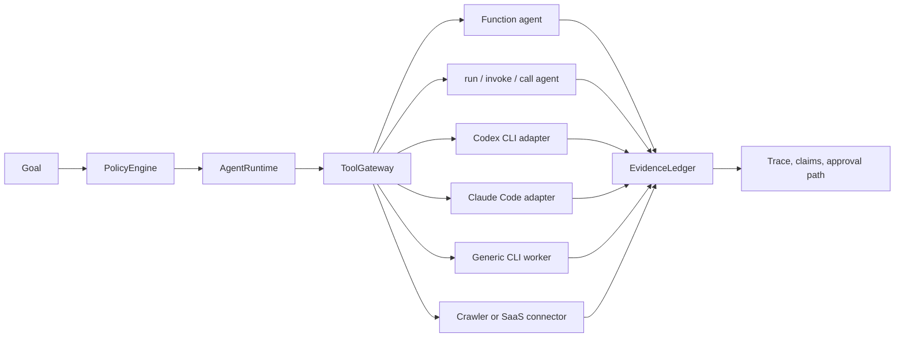

# Maqam

[](https://www.npmjs.com/package/maqam)
[](https://github.com/AjnasNB/maqam/actions/workflows/ci.yml)
[](https://github.com/AjnasNB/maqam/blob/v0.2.4/LICENSE)

**Policy before execution. Exact approval for the call. Evidence behind the claim.**


Maqam is an MIT-licensed agent framework for governed workflows. It combines a local runtime, policy engine, evidence ledger, skill registry, tool gateway, exact human approvals, generic worker adapters, coding-agent CLI adapters, and a crawler-backed research workflow.

The crawler is not the product center; it is only one built-in connector. Maqam governs workers that enter through `ToolGateway`, including function agents, object agents with `run`/`invoke`/`call`, Codex CLI, Claude Code, generic command-line workers, browser agents, research agents, internal services, and write actions that need human approval.

[](https://github.com/AjnasNB/maqam/releases/download/v0.2.4/maqam-exact-approval-demo.mp4)

The video is rendered from the JSON emitted by the real `maqam demo approval --json` command. The displayed approval id, hashes, execution counts, evidence ids, and rejection codes come from the executed package rather than a staged interface.

Full documentation: [docs/usage.md](https://github.com/AjnasNB/maqam/blob/main/docs/usage.md)

Five-minute quickstart and cleanup: [docs/quickstart.md](https://github.com/AjnasNB/maqam/blob/main/docs/quickstart.md)

Coding-agent guide: [docs/external-agents.md](https://github.com/AjnasNB/maqam/blob/main/docs/external-agents.md)

Release checklist: [docs/release-checklist.md](https://github.com/AjnasNB/maqam/blob/main/docs/release-checklist.md)

Provenance and license notes: [docs/provenance-and-licenses.md](https://github.com/AjnasNB/maqam/blob/main/docs/provenance-and-licenses.md)

Comparison with related open-source and source-available tools: [docs/comparison.md](https://github.com/AjnasNB/maqam/blob/main/docs/comparison.md)

Why Maqam: [docs/why-maqam.md](https://github.com/AjnasNB/maqam/blob/main/docs/why-maqam.md)

Public roadmap: [ROADMAP.md](https://github.com/AjnasNB/maqam/blob/main/ROADMAP.md)

Technical article: [Your Agent Approval May Not Authorize The Input That Actually Executes](https://github.com/AjnasNB/maqam/blob/main/docs/articles/exact-agent-approvals.md)

Benchmark methodology and raw evidence: [Maqam Benchmarking](https://github.com/AjnasNB/maqam/blob/main/docs/benchmarking.md)

Benchmarking article: [Benchmarking an Agent-Governance Boundary Without Fooling Yourself](https://github.com/AjnasNB/maqam/blob/main/docs/articles/benchmarking-agent-governance.md)

Migration guide for 0.2: [docs/migration-0.2.md](https://github.com/AjnasNB/maqam/blob/main/docs/migration-0.2.md)


## Universal Agent Control

Maqam controls agents by putting every worker behind the same gateway:



That means Maqam is not limited to crawling. If an agent can be called as a function, object method, HTTP/SDK connector, or fixed command-line worker, Maqam can route it through policy, runtime and call ceilings, trace capture, evidence, and configured human approval gates. Only registered adapters are governed; provider-reported token ceilings may be post-run, and a container or virtual machine is still needed for a hard operating-system boundary.

## Why Maqam

Maqam does not try to own the entire agent stack. Its focused job is to connect four controls in one small TypeScript package:

1. decide whether a registered tool call is allowed;
2. bind required approval to the exact run, tool, and canonical input hash;
3. consume that approval once by default and pass the same detached input to the governed handler; and
4. provide scoped APIs for handlers and workflows to explicitly connect claims to source evidence from the same run.

Use Maqam when that enforcement path matters more than adopting a larger platform. It can wrap an existing function, CLI worker, coding agent, crawler, browser connector, or internal service. Calls that bypass the registered adapter are outside Maqam's control, and evidence links show provenance rather than proving that a claim is true.

| If your primary need is | Stronger starting point | Where Maqam fits |
|---|---|---|
| Broad identity, trust, compliance, fleet, and multi-language governance | [Microsoft Agent Governance Toolkit](https://github.com/microsoft/agent-governance-toolkit) | A smaller local TypeScript boundary with explicit exact-call approval and claim/evidence semantics. |
| A full TypeScript agent loop, handoffs, sessions, models, and tracing | [OpenAI Agents SDK](https://github.com/openai/openai-agents-js) | Govern selected external actions; do not replace the SDK's agent loop or first-class human approval flow. |
| Durable, branching, restart-safe orchestration | [LangGraph](https://github.com/langchain-ai/langgraph) | Call Maqam-governed tools from graph nodes; Maqam's current state is in-process. |
| Contextual traffic, model-facing, or prompt-injection guardrails | [Invariant](https://github.com/invariantlabs-ai/invariant) or [NeMo Guardrails](https://github.com/NVIDIA-NeMo/Guardrails) | Add action policy, exact gateway approvals, and source-linked evidence. |
| Mature general policy-as-code | [Open Policy Agent](https://github.com/open-policy-agent/opa) | Use OPA as a decision engine while Maqam supplies the agent-specific enforcement and approval lifecycle. |
| Browser automation or crawler operations | [Crawl4AI](https://github.com/unclecode/crawl4ai), [Firecrawl](https://github.com/firecrawl/firecrawl), or [Crawlee](https://github.com/apify/crawlee) | Put a separately installed connector behind Maqam; its built-in crawler remains deliberately smaller and HTTP-only. |

See the [detailed, dated comparison](https://github.com/AjnasNB/maqam/blob/v0.2.4/docs/comparison.md), including limitations and source/license notes, before choosing a stack.

## What Ships

- `AgentRuntime`: sequential workflow execution with opt-in retries, cancellation-aware deadlines, trace events, unique run ids, task outputs, and policy preflight.
- `PolicyEngine`: fail-closed goal and tool-call decisions for allowed tools, origins, effects, clamped tenant limits, and approval gates.
- `EvidenceLedger`: private, transactional provenance records with computed source hashes, same-run claim links, confidence, and unsupported-claim checks.
- `ToolGateway`: a policy-required path with call ceilings, redacted traces, effective origin scope, non-downgradable handler effects and risk, fail-closed policy-decision validation, and exact one-time approval binding.
- `createAgentTool`: wraps any function agent or explicitly bound object agent so Maqam can control it through policy, trace, approval, and atomic evidence/claim capture.
- `createCliAgentTool`: wraps fixed command-line workers with cwd roots, environment allowlists, cancellation, timeout, approximate token limits, JSONL parsing, and no shell execution by default.
- `createCodexAgentTool`: runs Codex non-interactively with a read-only default, ephemeral sessions, JSONL activity, and normalized token usage.
- `createClaudeCodeAgentTool`: runs Claude Code with plan mode by default, no tools by default, max turns, spend limits, stream events, and normalized usage.
- `ApprovalQueue`: in-memory, serializable human approval records for release gates, external writes, and high-risk actions.
- `createReleaseGateReport`: release-evidence and exact publish-approval reporting; it reports readiness but does not execute publishing.
- `SkillRegistry`: private, snapshot-based skill metadata registration and selection.
- `createResearchWorkflow`: crawler-backed source collection, bounded result validation, synthesis, and quality checks.
- `maqam`: local web console for running governed research workflows.
- `maqam-crawl`: bounded crawler CLI with per-origin delay, robots.txt enforcement, redirect validation, DNS pinning, and public-network-only defaults.

## Why It Matters

Agent systems fail in production when tools run outside policy, outputs cannot be traced to sources, and risky actions happen without approval. Maqam makes those control points explicit:

- Every workflow starts with policy preflight.
- Tenant budgets and origin scope cannot be raised by a workflow.
- Every connected tool call goes through `ToolGateway` and is counted per run.
- Every source-backed claim can be recorded in `EvidenceLedger`.
- Tasks and tools receive run/task/tool-scoped evidence facades; they cannot choose trusted attribution fields or access the raw ledger.
- Every run returns trace data for inspection; Maqam does not yet provide durable replay or restart-safe checkpoints.
- Approval-required actions fail closed with `ApprovalRequiredError`.
- Approval records are bound to the exact run, tool, and input hash, then consumed once by default.
- The crawler blocks private and special-purpose destinations by default and validates every redirect hop.

## Install

Maqam requires Node.js 20.18.1 or later.

```bash
npm install -g maqam
```

Run the exact-approval proof without a model key or hosted account:

```bash
maqam demo approval
maqam demo approval --json
```

The flow requests approval, rejects altered input with `APPROVAL_SCOPE_MISMATCH` while executions remain zero, executes the exact input once, rejects replay with `APPROVAL_INVALID`, and links `ev_1` to `claim_1`.

Run the local console:

```bash
maqam
```

Then open `http://127.0.0.1:8787`.

Use inside a project:

```bash
npm install maqam
```

## Crawler CLI

```bash
maqam-crawl https://example.com --max-pages 50 --jsonl --output crawl.jsonl
```

Legacy aliases `ajnas-crawl` and `ajnas-agent-crawler` are kept for compatibility.

Options:

- `--max-pages <n>`: maximum pages to return. Default: `50`
- `--concurrency <n>`: concurrent workers. Default: `4`
- `--delay <ms>`: minimum delay per origin. Default: `250`
- `--timeout <ms>`: request timeout. Default: `15000`
- `--sitemaps`: discover URLs from robots.txt sitemaps and `/sitemap.xml`
- `--all-origins`: allow crawling across discovered origins
- `--jsonl`: output JSON Lines instead of a JSON array
- `--output <file>`: write output to a file
- `--user-agent <ua>`: custom user agent

The CLI accepts public HTTP(S) targets only. It validates every DNS result and redirect, rejects embedded credentials and special-purpose address ranges, obeys robots.txt by default, and caps each response. `--all-origins` removes the same-origin link restriction, so use it only when that wider public-network scope is intended.

## Framework SDK

```js
import {
  AgentRuntime,
  EvidenceLedger,
  PolicyEngine,
  ToolGateway,
  createAgentTool,
  createCliAgentTool,
  createCrawlerTool,
  createResearchWorkflow
} from "maqam";

const evidenceLedger = new EvidenceLedger();
const policyEngine = new PolicyEngine({
  allowedTools: ["crawler", "summarizer"],
  allowedOrigins: ["https://github.com", "https://www.npmjs.com"]
});

const gateway = new ToolGateway({ policyEngine, evidenceLedger });
gateway.registerTool("crawler", createCrawlerTool());
gateway.registerTool("summarizer", createAgentTool(async (input) => ({
  summary: `Reviewed ${input.topic}`
}), { name: "summarizer" }));
gateway.registerTool("localWorker", createCliAgentTool({
  name: "localWorker",
  command: process.execPath,
  args: ["--version"],
  stdin: "none",
  timeoutMs: 5000,
  maxInputTokens: 20,
  maxOutputBytes: 2048
}));

const runtime = new AgentRuntime({ policyEngine, evidenceLedger, toolGateway: gateway });
const result = await runtime.runWorkflow(
  createResearchWorkflow({
    seeds: ["https://github.com/apify/crawlee"],
    maxPages: 5
  }),
  {
    objective: "Research permissive OSS agent framework projects",
    allowedTools: ["crawler", "summarizer"],
    allowedOrigins: ["https://github.com"]
  }
);

console.log(result.outputs.synthesize_report.candidates);
```

## Coding Agent Adapters

```js
import {
  PolicyEngine,
  ToolGateway,
  createClaudeCodeAgentTool,
  createCodexAgentTool
} from "maqam";

const policyEngine = new PolicyEngine({
  allowedTools: ["codex", "claude"],
  approvalRequiredEffects: ["write"]
});
const gateway = new ToolGateway({ policyEngine });

gateway.registerTool("codex", createCodexAgentTool({
  cwd: process.cwd(),
  sandbox: "read-only",
  timeoutMs: 120_000,
  maxTotalTokens: 50_000
}));

gateway.registerTool("claude", createClaudeCodeAgentTool({
  cwd: process.cwd(),
  permissionMode: "plan",
  tools: [],
  maxTurns: 2,
  maxBudgetUsd: 0.25
}));
```

Both adapters isolate inherited environment variables, pass prompts over stdin, reject dangerous modes unless explicitly unlocked, normalize provider events, and support explicit outcome checks. Codex token ceilings are observed after the run because its CLI does not expose a hard token-budget flag; Claude Code can additionally enforce max turns and a spend ceiling. See [docs/external-agents.md](docs/external-agents.md) for complete setup, write-mode approvals, verification, limits, and security boundaries.

## Crawler API

```js
import { crawl } from "maqam";

const pages = await crawl({
  seeds: ["https://example.com"],
  maxPages: 25,
  concurrency: 4,
  includeSitemaps: true,
  onPage(page) {
    console.log(page.url, page.title);
  }
});

console.log(pages[0].markdown);
```

Private, loopback, link-local, reserved, and other special-purpose destinations are blocked by default. Every redirect is re-authorized and each connection is pinned to a validated DNS result. `allowPrivateNetworks: true` is a trusted local opt-in for supported private ranges; it does not allow link-local metadata endpoints or other unsafe ranges.

For failures and budget statistics, use `crawlDetailed`:

```js
import { crawlDetailed } from "maqam";

const result = await crawlDetailed({
  seeds: ["https://example.com"],
  allowedOrigins: ["https://example.com"],
  maxPages: 10,
  maxRequests: 80,
  maxDepth: 5
});

console.log(result.pages, result.failures, result.stats);
```

## Maqam Console

```bash
npm run maqam
```

The console runs a governed research workflow through:

- `PolicyEngine`: allows or denies goals and tool calls.
- `ToolGateway`: routes all external work through policy checks.
- `EvidenceLedger`: records source-backed evidence and claim support.
- `AgentRuntime`: executes workflow tasks with traces and retries.
- `createResearchWorkflow`: composes crawler collection, synthesis, and quality checks.

Brand assets live in `app/assets/`, including `maqam-logo.svg` and `maqam-brand-board.png`.

Applications can import the typed server API from `maqam/server`:

```js
import { startMaqamServer } from "maqam/server";

startMaqamServer({
  host: "127.0.0.1",
  allowedOrigins: ["https://example.com"]
});
```

The console accepts crawl authority only from trusted startup options. Request bodies cannot enable private networks or add origins. `startMaqamServer()` accepts `MAQAM_API_TOKEN` or `apiToken`; a raw server returned by `createMaqamServer()` requires `options.apiToken`. Both paths also require an explicit Host allowlist before binding beyond loopback. Calling `listen(port)` without a host, passing ambiguous transport options, or supplying an existing handle/file descriptor is rejected without those protections. Browser clients on another origin must be explicitly listed with repeatable `--allowed-ui-origin https://console.example` flags or `allowedUiOrigins`; CORS responses echo only the exact allowed origin and never use `*`.

## Principles

- Respect `robots.txt` by default.
- Use a clear user agent.
- Rate-limit per origin.
- Validate DNS results and each redirect before connecting.
- Keep private-network crawling disabled unless a trusted local deployment explicitly needs it.
- Avoid bypassing access controls, paywalls, anti-bot systems, or private content.
- No required model provider dependency.
- No required external hosted service.
- Produce JSON/JSONL output that agents can consume directly.

## What This Is Not

Maqam is not a stealth scraper and does not include bypass tooling. It will not help evade login walls, paywalls, anti-bot protections, CAPTCHA, robots.txt, or authorization boundaries.

## Development

```bash
npm install
npm test
npm run test:consumer-types
npm run demo:approval
npm run benchmark:mges:conformance
npm run benchmark:mges:performance
npm audit --omit=dev
npm pack --dry-run
```

The project-defined [Maqam Governance Evaluation Suite (MGES) v1](benchmarks/README.md) keeps performance and conformance separate. Its clean-source 30-observation Windows/Node 24 local-call result is `127.498 microseconds/call` median, with a `126.334-128.942 microseconds/call` 95% bootstrap interval for the sample median and `5.572%` coefficient of variation. The separate governance profile passes `12/12` named fixtures.

Those figures are local regression evidence, not a globally standardized benchmark, cross-product speed comparison, security score, certification, network benchmark, or production SLA. Read the [raw artifacts, complete methodology and publication wording](benchmarks/README.md) or the detailed article, [Benchmarking an agent-governance boundary without fooling yourself](docs/articles/benchmarking-agent-governance.md), before quoting them. The artifacts record clean source commit `44c198f9eab1ea3a2dedb1f784413a2733b7745d`; later release commits may change files outside the measured path, but any change to a fingerprinted source requires another run.

The npm tarball intentionally excludes the large brand-board and presentation PNG files; those remain in the source repository. Only the logo and files required by the local console ship as runtime app assets.

## Publish

Publishing is approval-gated. Do not publish a release until the current release checklist is complete and the package owner has explicitly approved that exact version.

```bash
npm publish --access public
```

Run the publish command from the reviewed repository directory; do not pass a local `.tgz` path to `npm publish`. Publishing requires an authenticated npm session with permission to publish the `maqam` package. After publishing, verify the registry `gitHead` and confirm `_resolved` and `_from` do not expose a local filesystem path.

## License

MIT

## Open Development

Maqam is open source under MIT and open for development, issues, ideas, and contributions.
