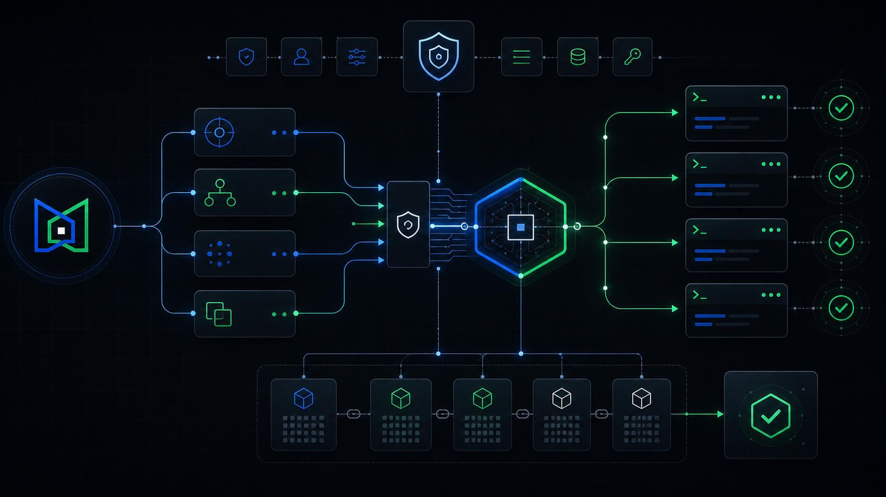
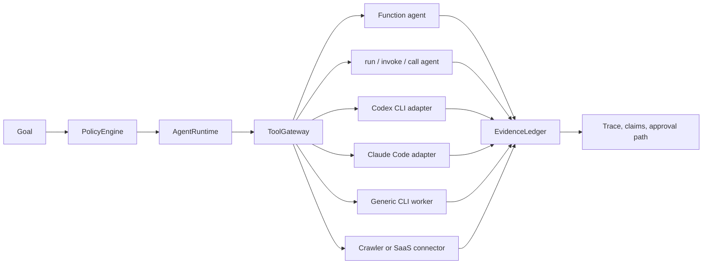

# Maqam


Maqam is an MIT-licensed agent framework for governed workflows. It combines a local runtime, policy engine, evidence ledger, skill registry, tool gateway, exact human approvals, generic worker adapters, coding-agent CLI adapters, and a crawler-backed research workflow.

The crawler is not the product center; it is only one built-in connector. Maqam governs workers that enter through `ToolGateway`, including function agents, object agents with `run`/`invoke`/`call`, Codex CLI, Claude Code, generic command-line workers, browser agents, research agents, internal services, and write actions that need human approval.

Full documentation: [docs/usage.md](https://github.com/AjnasNB/maqam/blob/main/docs/usage.md)

Coding-agent guide: [docs/external-agents.md](https://github.com/AjnasNB/maqam/blob/main/docs/external-agents.md)

Release checklist: [docs/release-checklist.md](https://github.com/AjnasNB/maqam/blob/main/docs/release-checklist.md)

Provenance and license notes: [docs/provenance-and-licenses.md](https://github.com/AjnasNB/maqam/blob/main/docs/provenance-and-licenses.md)




## Universal Agent Control

Maqam controls agents by putting every worker behind the same gateway:



That means Maqam is not limited to crawling. If an agent can be called as a function, object method, HTTP/SDK connector, or fixed command-line worker, Maqam can route it through policy, enforced budgets, trace capture, evidence, and human approval gates. Only registered adapters are governed; use a container or virtual machine when a hard operating-system boundary is required.

## What Ships

- `AgentRuntime`: sequential workflow execution with retries, enforced run deadlines, trace events, task outputs, and policy preflight.
- `PolicyEngine`: deterministic goal and tool-call decisions for allowed tools, origins, effects, clamped tenant limits, and approval gates.
- `EvidenceLedger`: provenance records, claim links, source hashes, confidence, and unsupported-claim checks.
- `ToolGateway`: one governed path with call ceilings, redacted traces, effect policy, and exact one-time approval binding.
- `createAgentTool`: wraps any function agent or object agent so Maqam can control it through policy, trace, approval, and evidence.
- `createCliAgentTool`: wraps fixed command-line workers with cwd roots, environment allowlists, cancellation, timeout, approximate token limits, JSONL parsing, and no shell execution by default.
- `createCodexAgentTool`: runs Codex non-interactively with a read-only default, ephemeral sessions, JSONL activity, and normalized token usage.
- `createClaudeCodeAgentTool`: runs Claude Code with plan mode by default, no tools by default, max turns, spend limits, stream events, and normalized usage.
- `ApprovalQueue`: durable human approval requests for release gates, external writes, and high-risk actions.
- `createReleaseGateReport`: production-readiness and publish-approval reporting for package releases.
- `SkillRegistry`: lightweight skill metadata registration and selection.
- `createResearchWorkflow`: crawler-backed source collection, synthesis, and quality checks.
- `maqam`: local web console for running governed research workflows.
- `maqam-crawl`: respectful crawler CLI that obeys `robots.txt` by default.

## Why It Matters

Agent systems fail in production when tools run outside policy, outputs cannot be traced to sources, and risky actions happen without approval. Maqam makes those control points explicit:

- Every workflow starts with policy preflight.
- Tenant budgets cannot be raised by a workflow.
- Every connected tool call goes through `ToolGateway` and is counted per run.
- Every source-backed claim can be recorded in `EvidenceLedger`.
- Every run returns trace data for inspection and replay.
- Approval-required actions fail closed with `ApprovalRequiredError`.
- Approval records are bound to the exact run, tool, and input hash, then consumed once by default.
- The crawler supports research and ingestion while preserving compliance defaults.

## Install

```bash
npm install -g maqam
```

Run the local console:

```bash
maqam
```

Then open `http://127.0.0.1:8787`.

Use inside a project:

```bash
npm install maqam
```

## Crawler CLI

```bash
maqam-crawl https://example.com --max-pages 50 --jsonl --output crawl.jsonl
```

Legacy aliases `ajnas-crawl` and `ajnas-agent-crawler` are kept for compatibility.

Options:

- `--max-pages <n>`: maximum pages to return. Default: `50`
- `--concurrency <n>`: concurrent workers. Default: `4`
- `--delay <ms>`: minimum delay per origin. Default: `250`
- `--timeout <ms>`: request timeout. Default: `15000`
- `--sitemaps`: discover URLs from robots.txt sitemaps and `/sitemap.xml`
- `--all-origins`: allow crawling across discovered origins
- `--jsonl`: output JSON Lines instead of a JSON array
- `--output <file>`: write output to a file
- `--user-agent <ua>`: custom user agent

## Framework SDK

```js
import {
  AgentRuntime,
  EvidenceLedger,
  PolicyEngine,
  ToolGateway,
  createAgentTool,
  createCliAgentTool,
  createCrawlerTool,
  createResearchWorkflow
} from "maqam";

const evidenceLedger = new EvidenceLedger();
const policyEngine = new PolicyEngine({
  allowedTools: ["crawler", "summarizer"],
  allowedOrigins: ["https://github.com", "https://www.npmjs.com"]
});

const gateway = new ToolGateway({ policyEngine, evidenceLedger });
gateway.registerTool("crawler", createCrawlerTool());
gateway.registerTool("summarizer", createAgentTool(async (input) => ({
  summary: `Reviewed ${input.topic}`
}), { name: "summarizer" }));
gateway.registerTool("localWorker", createCliAgentTool({
  name: "localWorker",
  command: process.execPath,
  args: ["--version"],
  stdin: "none",
  timeoutMs: 5000,
  maxInputTokens: 20,
  maxOutputBytes: 2048
}));

const runtime = new AgentRuntime({ policyEngine, evidenceLedger, toolGateway: gateway });
const result = await runtime.runWorkflow(
  createResearchWorkflow({
    seeds: ["https://github.com/apify/crawlee"],
    maxPages: 5
  }),
  {
    objective: "Research permissive OSS agent framework projects",
    allowedTools: ["crawler", "summarizer"],
    allowedOrigins: ["https://github.com"]
  }
);

console.log(result.outputs.synthesize_report.candidates);
```

## Coding Agent Adapters

```js
import {
  PolicyEngine,
  ToolGateway,
  createClaudeCodeAgentTool,
  createCodexAgentTool
} from "maqam";

const policyEngine = new PolicyEngine({
  allowedTools: ["codex", "claude"],
  approvalRequiredEffects: ["write"]
});
const gateway = new ToolGateway({ policyEngine });

gateway.registerTool("codex", createCodexAgentTool({
  cwd: process.cwd(),
  sandbox: "read-only",
  timeoutMs: 120_000,
  maxTotalTokens: 50_000
}));

gateway.registerTool("claude", createClaudeCodeAgentTool({
  cwd: process.cwd(),
  permissionMode: "plan",
  tools: [],
  maxTurns: 2,
  maxBudgetUsd: 0.25
}));
```

Both adapters isolate inherited environment variables, pass prompts over stdin, reject dangerous modes unless explicitly unlocked, normalize provider events, and support explicit outcome checks. Codex token ceilings are observed after the run because its CLI does not expose a hard token-budget flag; Claude Code can additionally enforce max turns and a spend ceiling. See [docs/external-agents.md](docs/external-agents.md) for complete setup, write-mode approvals, verification, limits, and security boundaries.

## Crawler API

```js
import { crawl } from "maqam";

const pages = await crawl({
  seeds: ["https://example.com"],
  maxPages: 25,
  concurrency: 4,
  includeSitemaps: true,
  onPage(page) {
    console.log(page.url, page.title);
  }
});

console.log(pages[0].markdown);
```

## Maqam Console

```bash
npm run maqam
```

The console runs a governed research workflow through:

- `PolicyEngine`: allows or denies goals and tool calls.
- `ToolGateway`: routes all external work through policy checks.
- `EvidenceLedger`: records source-backed evidence and claim support.
- `AgentRuntime`: executes workflow tasks with traces and retries.
- `createResearchWorkflow`: composes crawler collection, synthesis, and quality checks.

Brand assets live in `app/assets/`, including `maqam-logo.svg` and `maqam-brand-board.png`.

## Principles

- Respect `robots.txt` by default.
- Use a clear user agent.
- Rate-limit per origin.
- Avoid bypassing access controls, paywalls, anti-bot systems, or private content.
- No required model provider dependency.
- No required external hosted service.
- Produce JSON/JSONL output that agents can consume directly.

## What This Is Not

Maqam is not a stealth scraper and does not include bypass tooling. It will not help evade login walls, paywalls, anti-bot protections, CAPTCHA, robots.txt, or authorization boundaries.

## Development

```bash
npm install
npm test
npm pack --dry-run
```

## Publish

Publishing is approval-gated. Do not publish a release until the current release checklist is complete and the package owner has explicitly approved that exact version.

```bash
npm publish --access public
```

Publishing requires an authenticated npm session with permission to publish the `maqam` package.

## License

MIT

## Open Development

Maqam is open source under MIT and open for development, issues, ideas, and contributions.
