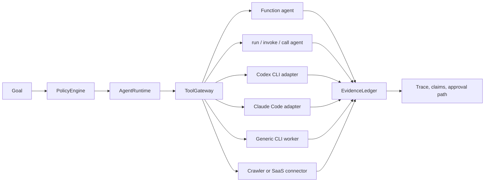

# Maqam

[](https://www.npmjs.com/package/maqam)
[](https://github.com/AjnasNB/maqam/actions/workflows/ci.yml)
[](https://github.com/AjnasNB/maqam/blob/main/LICENSE)

**Policy before execution. Exact approval for the call. Evidence behind the claim.**


**In plain English:** Maqam is a security turnstile for actions performed by software agents. It checks policy, binds approval to the exact input that will run, allows that approved call once, and records what happened.

More technically, Maqam is an MIT-licensed TypeScript execution boundary for governed workflows. It combines a local runtime, policy engine, evidence ledger, skill registry, tool gateway, exact human approvals, generic worker adapters, coding-agent CLI adapters, and a crawler-backed research workflow.

The crawler is not the product center; it is one built-in connector. Maqam governs workers that enter through `ToolGateway`, including function agents, explicitly bound object agents, Codex CLI, Claude Code, generic command-line workers, browser and research adapters, internal services, and write actions that need human approval. Calls that bypass a registered adapter are outside Maqam's control.

> **Release status — 2026-07-17:** [`maqam@0.2.4`](https://www.npmjs.com/package/maqam) is live on npm with trusted-publishing provenance. The matching [`v0.2.4` GitHub release](https://github.com/AjnasNB/maqam/releases/tag/v0.2.4) includes the reviewed tarball, checksums, benchmark artifacts, videos, transcripts, and product-specific 3D release art.

> **0.3.0 release line — 2026-07-18:** this line adds governed source routing, normalized research documents, offline RSS/Atom parsing, feed-aware crawling, and exact cross-origin CLI controls. Verify public availability from the exact [`maqam@0.3.0`](https://www.npmjs.com/package/maqam/v/0.3.0) registry record, provenance, integrity, matching Git tag, and GitHub release; source metadata alone is not publication proof. See the [release record](docs/release-0.3.0.md) and [migration guide](docs/migration-0.3.md).

[Website](https://maqamagent.com/) · [Full documentation](https://maqamagent.com/docs/) · [Why Maqam](https://maqamagent.com/why/) · [ProductLoop OS](https://maqamagent.com/docs/productloop/) · [Community](https://maqamagent.com/community/)

## Maqam and ProductLoop OS

**Maqam is the guarded door. ProductLoop OS is the toolbox around it.**

Maqam is the governed execution kernel: policy before a registered operation, approval bound to the exact run/tool/input, one-use consumption by default, and reviewable trace and evidence records. [ProductLoop OS](https://github.com/AjnasNB/productloop-os) is the companion ecosystem: its public umbrella and eight small packages add workflow runtime, policy decisions, approval operations, provenance, evaluations, connector trust, skill manifests, and replayable browser-research records.

They are one ecosystem with explicit boundaries, not one silently merged runtime. `productloop-os@0.2.1` exposes Maqam and the Ajnas packages as named namespaces and tested adapters, while their contracts and ledgers remain distinct.

| Choose | When you need |
|---|---|
| `maqam@0.3.0` (after exact registry verification) | One compact boundary around tool calls, exact approvals, worker adapters, traces, evidence, governed source routing, or bounded HTTP/feed research |
| `productloop-os@0.2.1` | The wider modular package family for runtime, policy, approvals, provenance, skills, connectors, evaluations, and research |
| Both beneath an orchestrator | Google ADK, OpenAI Agents SDK, LangGraph, or another agent loop already plans work and Maqam should govern selected side effects |

Maqam and ProductLoop do not replace model providers, durable orchestration, identity, databases, browser engines, or operating-system sandboxes. Only operations routed through a registered boundary are governed. See the [package atlas and copy-paste examples](https://maqamagent.com/docs/productloop/).

## Watch the Proofs

[](https://maqamagent.com/media/releases/maqam/v0.2.4/maqam-exact-approval-demo.mp4)

The exact-approval video is rendered from JSON emitted by the real `maqam demo approval --json` command. Its approval id, hashes, execution counts, evidence ids, and rejection codes come from the released implementation rather than a staged interface.

| Demonstration | Video | Captions |
|---|---|---|
| Exact approval: altered input blocked, exact input executed once, replay blocked | [MP4](https://maqamagent.com/media/releases/maqam/v0.2.4/maqam-exact-approval-demo.mp4) | [VTT](https://maqamagent.com/media/releases/maqam/v0.2.4/maqam-exact-approval-demo.vtt) · [SRT](https://maqamagent.com/media/releases/maqam/v0.2.4/maqam-exact-approval-demo.srt) |
| ProductLoop OS: Maqam plus eight explicit package namespaces | [MP4](https://maqamagent.com/media/releases/maqam/v0.2.4/productloop-os-ecosystem-overview.mp4) | [VTT](https://maqamagent.com/media/releases/maqam/v0.2.4/productloop-os-ecosystem-overview.vtt) · [SRT](https://maqamagent.com/media/releases/maqam/v0.2.4/productloop-os-ecosystem-overview.srt) |
| Governed crawler research: bounded collection, citations, and evidence | [MP4](https://maqamagent.com/media/releases/maqam/v0.2.4/maqam-crawler-governed-research.mp4) | [VTT](https://maqamagent.com/media/releases/maqam/v0.2.4/maqam-crawler-governed-research.vtt) · [SRT](https://maqamagent.com/media/releases/maqam/v0.2.4/maqam-crawler-governed-research.srt) |

## Documentation Map

| Start with | Use it for |
|---|---|
| [Five-minute quickstart](https://github.com/AjnasNB/maqam/blob/main/docs/quickstart.md) and [full usage guide](https://github.com/AjnasNB/maqam/blob/main/docs/usage.md) | Local proof, installation, APIs, cleanup, and deployment boundaries |
| [Why Maqam](https://maqamagent.com/why/) and [detailed comparison](https://github.com/AjnasNB/maqam/blob/main/docs/comparison.md) | Product fit, alternatives, differences, limitations, sources, and licenses |
| [ProductLoop package atlas](https://maqamagent.com/docs/productloop/) | Package-by-package roles, versions, examples, and Maqam relationship |
| [Integration guide](https://maqamagent.com/docs/integrations/) and [Google ADK / Microsoft Agent 365 boundary](https://github.com/AjnasNB/maqam/blob/main/docs/integrations-google-adk-agent365.md) | Host adapters, prerequisites, copy-paste templates, and bypass warnings |
| [Governed Sources](https://github.com/AjnasNB/maqam/blob/main/docs/governed-sources.md) | Ordered source adapters, `ToolGateway` routing, normalized documents, source doctor, RSS/Atom, fallback, and security boundaries |
| [MGES benchmark guide](https://maqamagent.com/docs/benchmark/) and [raw methodology](https://github.com/AjnasNB/maqam/blob/main/benchmarks/README.md) | Reproducible local-call and conformance evidence with claim limits |
| [Security guide](https://maqamagent.com/docs/security/) and [security policy](https://github.com/AjnasNB/maqam/blob/main/SECURITY.md) | Threat boundaries, reporting, crawler safety, and required host controls |
| [Coding-agent guide](https://github.com/AjnasNB/maqam/blob/main/docs/external-agents.md) | Codex, Claude Code, generic CLI workers, approvals, and outcome checks |
| [Public roadmap](https://maqamagent.com/roadmap/) and [source roadmap](https://github.com/AjnasNB/maqam/blob/main/ROADMAP.md) | Shipped baseline, next work, exit criteria, and explicit non-goals |
| [Community hub](https://maqamagent.com/community/), [contributing](https://github.com/AjnasNB/maqam/blob/main/CONTRIBUTING.md), and [governance](https://github.com/AjnasNB/maqam/blob/main/GOVERNANCE.md) | Questions, examples, issues, forks, reviewed pull requests, and maintenance policy |
| [0.2.4 release note](https://maqamagent.com/releases/v0.2.4/), [source release record](https://github.com/AjnasNB/maqam/blob/main/docs/release-0.2.4-candidate.md), [Release checklist](https://github.com/AjnasNB/maqam/blob/main/docs/release-checklist.md), and [Provenance and license notes](https://github.com/AjnasNB/maqam/blob/main/docs/provenance-and-licenses.md) | Exact package map, verification evidence, MGES caveats, provenance, licenses, and approval history |
| [0.3.0 release record](https://github.com/AjnasNB/maqam/blob/main/docs/release-0.3.0.md) and [0.3 migration guide](https://github.com/AjnasNB/maqam/blob/main/docs/migration-0.3.md) | New source-routing surface, breaking CLI change, required verification, exact-artifact approval, and historical-evidence rules |

Articles: [Your Agent Approval May Not Authorize the Input That Actually Executes](https://maqamagent.com/articles/exact-agent-approvals/) · [Benchmarking an Agent-Governance Boundary Without Fooling Yourself](https://maqamagent.com/articles/benchmarking-governance/)


## Universal Agent Control

Maqam controls agents by putting every worker behind the same gateway:



That means Maqam is not limited to crawling. If an agent can be called as a function, object method, HTTP/SDK connector, or fixed command-line worker, Maqam can route it through policy, runtime and call ceilings, trace capture, evidence, and configured human approval gates. Only registered adapters are governed; provider-reported token ceilings may be post-run, and a container or virtual machine is still needed for a hard operating-system boundary.

## Why Maqam

Maqam does not try to own the entire agent stack. Its focused job is to connect four controls in one small TypeScript package:

1. decide whether a registered tool call is allowed;
2. bind required approval to the exact run, tool, and canonical input hash;
3. consume that approval once by default and pass the same detached input to the governed handler; and
4. provide scoped APIs for handlers and workflows to explicitly connect claims to source evidence from the same run.

Use Maqam when that enforcement path matters more than adopting a larger platform. It can wrap an existing function, CLI worker, coding agent, crawler, browser connector, or internal service. Calls that bypass the registered adapter are outside Maqam's control, and evidence links show provenance rather than proving that a claim is true.

| If your primary need is | Stronger starting point | Where Maqam fits |
|---|---|---|
| Broad identity, trust, compliance, fleet, and multi-language governance | [Microsoft Agent Governance Toolkit](https://github.com/microsoft/agent-governance-toolkit) | A smaller local TypeScript boundary with explicit exact-call approval and claim/evidence semantics. |
| A full TypeScript agent loop, handoffs, sessions, models, and tracing | [OpenAI Agents SDK](https://github.com/openai/openai-agents-js) | Govern selected external actions; do not replace the SDK's agent loop or first-class human approval flow. |
| Durable, branching, restart-safe orchestration | [LangGraph](https://github.com/langchain-ai/langgraph) | Call Maqam-governed tools from graph nodes; Maqam's current state is in-process. |
| Contextual traffic, model-facing, or prompt-injection guardrails | [Invariant](https://github.com/invariantlabs-ai/invariant) or [NeMo Guardrails](https://github.com/NVIDIA-NeMo/Guardrails) | Add action policy, exact gateway approvals, and source-linked evidence. |
| Mature general policy-as-code | [Open Policy Agent](https://github.com/open-policy-agent/opa) | Use OPA as a decision engine while Maqam supplies the agent-specific enforcement and approval lifecycle. |
| Browser automation or crawler operations | [Crawl4AI](https://github.com/unclecode/crawl4ai), [Firecrawl](https://github.com/firecrawl/firecrawl), or [Crawlee](https://github.com/apify/crawlee) | Put a separately installed connector behind Maqam; its built-in crawler remains deliberately smaller and HTTP-only. |

See the [detailed, dated comparison](https://github.com/AjnasNB/maqam/blob/main/docs/comparison.md), including limitations and source/license notes, before choosing a stack.

## What Ships

- `AgentRuntime`: sequential workflow execution with opt-in retries, cancellation-aware deadlines, trace events, unique run ids, task outputs, and policy preflight.
- `PolicyEngine`: fail-closed goal and tool-call decisions for allowed tools, origins, effects, clamped tenant limits, and approval gates.
- `EvidenceLedger`: private, transactional provenance records with computed source hashes, same-run claim links, confidence, and unsupported-claim checks.
- `ToolGateway`: a policy-required path with call ceilings, redacted traces, effective origin scope, non-downgradable handler effects and risk, fail-closed policy-decision validation, and exact one-time approval binding.
- `createAgentTool`: wraps any function agent or explicitly bound object agent so Maqam can control it through policy, trace, approval, and atomic evidence/claim capture.
- `createCliAgentTool`: wraps fixed command-line workers with cwd roots, environment allowlists, cancellation, timeout, approximate token limits, JSONL parsing, and no shell execution by default.
- `createCodexAgentTool`: runs Codex non-interactively with a read-only default, ephemeral sessions, JSONL activity, and normalized token usage.
- `createClaudeCodeAgentTool`: runs Claude Code with plan mode by default, no tools by default, max turns, spend limits, stream events, and normalized usage.
- `ApprovalQueue`: in-memory, serializable human approval records for release gates, external writes, and high-risk actions.
- `createReleaseGateReport`: release-evidence and exact publish-approval reporting; it reports readiness but does not execute publishing.
- `SkillRegistry`: private, snapshot-based skill metadata registration and selection.
- `ResearchSourceRegistry`: deterministic source-backend selection with explicit preferences, fatal-error stop rules, governed `ToolCaller` routing, normalized documents, and bounded attempt records.
- `createWebCrawlerSourceAdapter`: connects a host-supplied `crawl()` or `createCrawlerTool()` function to the governed source registry under one fixed `research.web-crawler.direct` tool identity; the factory has no separate fetch, login, or credential fallback.
- `parseRssAtom` and RSS/Atom adapter factories: offline bounded feed parsing around a host-supplied reader, with no implicit network or login behavior.
- `createResearchWorkflow`: crawler-backed source collection, bounded result validation, synthesis, and quality checks.
- `maqam`: local web console for running governed research workflows.
- `maqam-crawl`: bounded crawler CLI with per-origin delay, robots.txt enforcement, redirect validation, DNS pinning, and public-network-only defaults.

## Why It Matters

Agent systems fail in production when tools run outside policy, outputs cannot be traced to sources, and risky actions happen without approval. Maqam makes those control points explicit:

- Every workflow starts with policy preflight.
- Tenant budgets and origin scope cannot be raised by a workflow.
- Every connected tool call goes through `ToolGateway` and is counted per run.
- Every source-backed claim can be recorded in `EvidenceLedger`.
- Tasks and tools receive run/task/tool-scoped evidence facades; they cannot choose trusted attribution fields or access the raw ledger.
- Every run returns trace data for inspection; Maqam does not yet provide durable replay or restart-safe checkpoints.
- Approval-required actions fail closed with `ApprovalRequiredError`.
- Approval records are bound to the exact run, tool, and input hash, then consumed once by default.
- The crawler blocks private and special-purpose destinations by default and validates every redirect hop.

## Install

Maqam requires Node.js 20.18.1 or later.

```bash
npm view maqam@0.3.0 version dist.integrity gitHead
npm install -g maqam@0.3.0
```

Run the exact-approval proof without a model key or hosted account:

```bash
maqam demo approval
maqam demo approval --json
maqam --version
```

The flow requests approval, rejects altered input with `APPROVAL_SCOPE_MISMATCH` while executions remain zero, executes the exact input once, rejects replay with `APPROVAL_INVALID`, and links `ev_1` to `claim_1`.

Run the local console:

```bash
maqam
```

Then open `http://127.0.0.1:8787`.

Use inside a project:

```bash
npm install maqam@0.3.0
```

## Crawler CLI

```bash
maqam-crawl https://example.com --max-pages 50 --jsonl --output crawl.jsonl
```

Legacy aliases `ajnas-crawl` and `ajnas-agent-crawler` are kept for compatibility.

Options:

- `--max-pages <n>`: maximum pages to return. Default: `50`
- `--max-requests <n>`: maximum network requests
- `--max-depth <n>`: maximum link depth. Default: `20`
- `--max-bytes <n>`: maximum bytes per response. Default: `3145728`
- `--max-duration <ms>`: maximum total crawl duration. Default: `600000`
- `--max-retries <n>`: retries per request. Default: `2`
- `--concurrency <n>`: concurrent workers. Default: `4`
- `--delay <ms>`: minimum delay per origin. Default: `250`
- `--timeout <ms>`: request timeout. Default: `15000`
- `--sitemaps`: discover URLs from robots.txt sitemaps and `/sitemap.xml`
- `--feeds`: discover and parse linked RSS/Atom feeds
- `--max-feed-links <n>` / `--max-feed-items <n>`: bound feed discovery and parsing
- `--allowed-origin <url>`: permit one additional origin; repeat for every origin
- `--detailed`: emit `{ pages, failures, stats }`
- `--stats`: write crawl statistics to stderr
- `--fail-on-error`: exit with status 2 when non-fatal failures are present
- `--jsonl`: output JSON Lines instead of a JSON array
- `--output <file>`: write output to a file
- `--user-agent <ua>`: custom user agent

The CLI accepts public HTTP(S) targets only. It validates every DNS result and redirect, rejects embedded credentials and special-purpose address ranges, obeys robots.txt by default, and caps each response. The old unbounded `--all-origins` switch is intentionally rejected; name every additional public origin with a repeatable `--allowed-origin` flag. `--detailed` and `--jsonl` cannot be combined.

## Governed Sources

Use `ResearchSourceRegistry` when one research channel has multiple possible backends but every selected operation must remain visible at `ToolGateway`:

```js
const sources = new ResearchSourceRegistry({
  adapters: [rssSource, internalSearch],
  toolCaller: defineResearchToolCaller({
    call: gateway.call.bind(gateway)
  })
});

const result = await sources.route({
  channel: "research",
  input: { query: "exact approvals" }
}, { runId: "research_1" });
```

Register every adapter handler at its declared `toolName` first. `route()` fails closed without a bound caller. `routeUngoverned()` is an explicit direct bypass and does not apply policy, approvals, call ceilings, or trace capture. Read the [complete guide](docs/governed-sources.md) before connecting credentials or remote providers.

## Framework SDK

```js
import {
  AgentRuntime,
  EvidenceLedger,
  PolicyEngine,
  ToolGateway,
  createAgentTool,
  createCliAgentTool,
  createCrawlerTool,
  createResearchWorkflow
} from "maqam";

const evidenceLedger = new EvidenceLedger();
const policyEngine = new PolicyEngine({
  allowedTools: ["crawler", "summarizer"],
  allowedOrigins: ["https://github.com", "https://www.npmjs.com"]
});

const gateway = new ToolGateway({ policyEngine, evidenceLedger });
gateway.registerTool("crawler", createCrawlerTool());
gateway.registerTool("summarizer", createAgentTool(async (input) => ({
  summary: `Reviewed ${input.topic}`
}), { name: "summarizer" }));
gateway.registerTool("localWorker", createCliAgentTool({
  name: "localWorker",
  command: process.execPath,
  args: ["--version"],
  stdin: "none",
  timeoutMs: 5000,
  maxInputTokens: 20,
  maxOutputBytes: 2048
}));

const runtime = new AgentRuntime({ policyEngine, evidenceLedger, toolGateway: gateway });
const result = await runtime.runWorkflow(
  createResearchWorkflow({
    seeds: ["https://github.com/apify/crawlee"],
    maxPages: 5
  }),
  {
    objective: "Research permissive OSS agent framework projects",
    allowedTools: ["crawler", "summarizer"],
    allowedOrigins: ["https://github.com"]
  }
);

console.log(result.outputs.synthesize_report.candidates);
```

## Coding Agent Adapters

```js
import {
  PolicyEngine,
  ToolGateway,
  createClaudeCodeAgentTool,
  createCodexAgentTool
} from "maqam";

const policyEngine = new PolicyEngine({
  allowedTools: ["codex", "claude"],
  approvalRequiredEffects: ["write"]
});
const gateway = new ToolGateway({ policyEngine });

gateway.registerTool("codex", createCodexAgentTool({
  cwd: process.cwd(),
  sandbox: "read-only",
  timeoutMs: 120_000,
  maxTotalTokens: 50_000
}));

gateway.registerTool("claude", createClaudeCodeAgentTool({
  cwd: process.cwd(),
  permissionMode: "plan",
  tools: [],
  maxTurns: 2,
  maxBudgetUsd: 0.25
}));
```

Both adapters isolate inherited environment variables, pass prompts over stdin, reject dangerous modes unless explicitly unlocked, normalize provider events, and support explicit outcome checks. Codex token ceilings are observed after the run because its CLI does not expose a hard token-budget flag; Claude Code can additionally enforce max turns and a spend ceiling. See [docs/external-agents.md](docs/external-agents.md) for complete setup, write-mode approvals, verification, limits, and security boundaries.

## Crawler API

```js
import { crawl } from "maqam";

const pages = await crawl({
  seeds: ["https://example.com"],
  maxPages: 25,
  concurrency: 4,
  includeSitemaps: true,
  onPage(page) {
    console.log(page.url, page.title);
  }
});

console.log(pages[0].markdown);
```

Private, loopback, link-local, reserved, and other special-purpose destinations are blocked by default. Every redirect is re-authorized and each connection is pinned to a validated DNS result. `allowPrivateNetworks: true` is a trusted local opt-in for supported private ranges; it does not allow link-local metadata endpoints or other unsafe ranges.

For failures and budget statistics, use `crawlDetailed`:

```js
import { crawlDetailed } from "maqam";

const result = await crawlDetailed({
  seeds: ["https://example.com"],
  allowedOrigins: ["https://example.com"],
  maxPages: 10,
  maxRequests: 80,
  maxDepth: 5
});

console.log(result.pages, result.failures, result.stats);
```

## Maqam Console

```bash
npm run maqam
```

The console runs a governed research workflow through:

- `PolicyEngine`: allows or denies goals and tool calls.
- `ToolGateway`: routes all external work through policy checks.
- `EvidenceLedger`: records source-backed evidence and claim support.
- `AgentRuntime`: executes workflow tasks with traces and retries.
- `createResearchWorkflow`: composes crawler collection, synthesis, and quality checks.

Brand assets live in `app/assets/`, including `maqam-logo.svg` and `maqam-brand-board.png`.

Applications can import the typed server API from `maqam/server`:

```js
import { startMaqamServer } from "maqam/server";

startMaqamServer({
  host: "127.0.0.1",
  allowedOrigins: ["https://example.com"]
});
```

The console accepts crawl authority only from trusted startup options. Request bodies cannot enable private networks or add origins. `startMaqamServer()` accepts `MAQAM_API_TOKEN` or `apiToken`; a raw server returned by `createMaqamServer()` requires `options.apiToken`. Both paths also require an explicit Host allowlist before binding beyond loopback. Calling `listen(port)` without a host, passing ambiguous transport options, or supplying an existing handle/file descriptor is rejected without those protections. Browser clients on another origin must be explicitly listed with repeatable `--allowed-ui-origin https://console.example` flags or `allowedUiOrigins`; CORS responses echo only the exact allowed origin and never use `*`.

## Principles

- Respect `robots.txt` by default.
- Use a clear user agent.
- Rate-limit per origin.
- Validate DNS results and each redirect before connecting.
- Keep private-network crawling disabled unless a trusted local deployment explicitly needs it.
- Avoid bypassing access controls, paywalls, anti-bot systems, or private content.
- No required model provider dependency.
- No required external hosted service.
- Produce JSON/JSONL output that agents can consume directly.

## What This Is Not

Maqam is not a stealth scraper and does not include bypass tooling. It will not help evade login walls, paywalls, anti-bot protections, CAPTCHA, robots.txt, or authorization boundaries.

## Development

```bash
npm install
npm test
npm run test:consumer-types
npm run demo:approval
npm run benchmark:mges:conformance
npm run benchmark:mges:performance
npm audit --omit=dev
npm pack --dry-run
```

The project-defined [Maqam Governance Evaluation Suite (MGES) v1.1.0](benchmarks/README.md) keeps performance and conformance separate. Its clean-source 30-observation Windows/Node 24 local-call result is `151.090 microseconds/call` median, with a `148.341-154.484 microseconds/call` 95% bootstrap interval for the sample median and `7.615%` governed coefficient of variation. The separate governance profile passes `14/14` named fixtures, including two governed-source routing cases.

Those figures are local regression evidence, not a globally standardized benchmark, cross-product speed comparison, security score, certification, network benchmark, or production SLA. Read the [raw artifacts, complete methodology and publication wording](benchmarks/README.md) or the detailed article, [Benchmarking an agent-governance boundary without fooling yourself](docs/articles/benchmarking-agent-governance.md), before quoting them. The artifacts record clean source commit `e57c1f8757ca863cc3bf57e76e024f115e624949`; later release commits may change files outside the measured path, but any change to a fingerprinted source requires another run.

The npm tarball intentionally excludes the large brand-board and presentation PNG files; those remain in the source repository. Only the logo and files required by the local console ship as runtime app assets.

## Publish

Package metadata targets `maqam@0.3.0`. Source metadata is not proof of publication: verify the exact npm version record, integrity, provenance, registry `gitHead`, matching Git tag, and GitHub release before describing the artifact as public. Do not republish an existing version. Releases use the maintainer-approved [trusted npm publishing workflow](https://github.com/AjnasNB/maqam/actions/workflows/publish-npm.yml), which rebuilds and verifies the exact approved artifact before npm's OIDC publisher accepts it.

Before a new version is approved, the final clean commit must pass the complete release checklist, a fresh tarball must be inspected and installed in a clean consumer, and the package owner must approve that artifact's filename, byte size, integrity, SHA-256, version, registry, command, and Git commit. After publication, verify the registry integrity, provenance, and `gitHead`, then create the matching annotated tag and GitHub release.

See the [0.3.0 release record](docs/release-0.3.0.md) for required evidence. The [0.2.4 source release record](https://github.com/AjnasNB/maqam/blob/main/docs/release-0.2.4-candidate.md) and [public GitHub release](https://github.com/AjnasNB/maqam/releases/tag/v0.2.4) remain historical evidence for that artifact.

## License

MIT

## Open Development

Maqam is open source under MIT. Start with the [community hub](https://maqamagent.com/community/) or [GitHub Discussions](https://github.com/AjnasNB/maqam/discussions) for questions, examples, and integration proposals. Changes should arrive through a fork or branch and a reviewed pull request; external contributors cannot merge directly to `main`.

Read [CONTRIBUTING.md](https://github.com/AjnasNB/maqam/blob/main/CONTRIBUTING.md), [GOVERNANCE.md](https://github.com/AjnasNB/maqam/blob/main/GOVERNANCE.md), [SUPPORT.md](https://github.com/AjnasNB/maqam/blob/main/SUPPORT.md), the [code of conduct](https://github.com/AjnasNB/maqam/blob/main/CODE_OF_CONDUCT.md), [security policy](https://github.com/AjnasNB/maqam/blob/main/SECURITY.md), and [public roadmap](https://github.com/AjnasNB/maqam/blob/main/ROADMAP.md) before opening a change.
