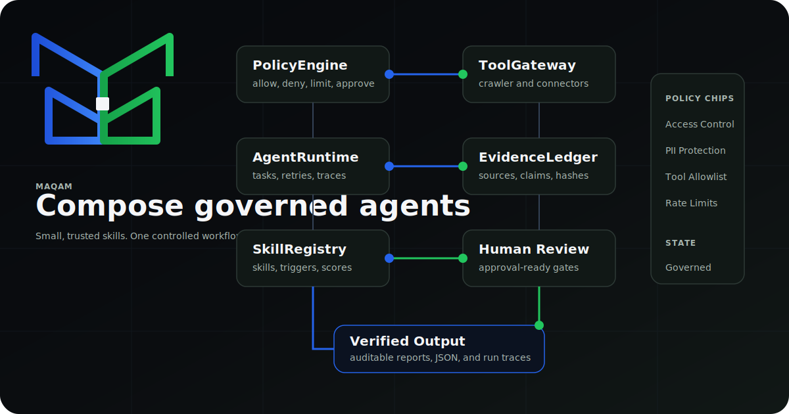

# Maqam


Maqam is an MIT-licensed Ajnas agent framework for governed workflows. It combines a local agent runtime, policy engine, evidence ledger, skill registry, tool gateway, human-review-ready approval errors, and a crawler-backed research workflow.

The crawler is no longer the product center; it is the first governed connector. Maqam is meant for enterprise agent workflows that need inspectable runs, source-backed outputs, compliance-friendly defaults, and no required hosted service.



## What Ships

- `AgentRuntime`: sequential workflow execution with retries, trace events, task outputs, and policy preflight.
- `PolicyEngine`: deterministic goal and tool-call decisions for allowed tools, origins, limits, and approval gates.
- `EvidenceLedger`: provenance records, claim links, source hashes, confidence, and unsupported-claim checks.
- `ToolGateway`: one governed path for external tool execution.
- `SkillRegistry`: lightweight skill metadata registration and selection.
- `createResearchWorkflow`: crawler-backed source collection, synthesis, and quality checks.
- `maqam`: local web console for running governed research workflows.
- `maqam-crawl`: respectful crawler CLI that obeys `robots.txt` by default.

## Why It Matters

Agent systems fail in production when tools run outside policy, outputs cannot be traced to sources, and risky actions happen without approval. Maqam makes those control points explicit:

- Every workflow starts with policy preflight.
- Every tool call goes through `ToolGateway`.
- Every source-backed claim can be recorded in `EvidenceLedger`.
- Every run returns trace data for inspection and replay.
- Approval-required actions fail closed with `ApprovalRequiredError`.
- The crawler supports research and ingestion while preserving compliance defaults.

## Install

```bash
npm install -g maqam
```

Run the local console:

```bash
maqam
```

Then open `http://127.0.0.1:8787`.

Run without global install:

```bash
npx maqam --port 8787
```

## Crawler CLI

```bash
maqam-crawl https://example.com --max-pages 50 --jsonl --output crawl.jsonl
```

Legacy aliases `ajnas-crawl` and `ajnas-agent-crawler` are kept for compatibility.

Options:

- `--max-pages <n>`: maximum pages to return. Default: `50`
- `--concurrency <n>`: concurrent workers. Default: `4`
- `--delay <ms>`: minimum delay per origin. Default: `250`
- `--timeout <ms>`: request timeout. Default: `15000`
- `--sitemaps`: discover URLs from robots.txt sitemaps and `/sitemap.xml`
- `--all-origins`: allow crawling across discovered origins
- `--jsonl`: output JSON Lines instead of a JSON array
- `--output <file>`: write output to a file
- `--user-agent <ua>`: custom user agent

## Framework SDK

```js
import {
  AgentRuntime,
  EvidenceLedger,
  PolicyEngine,
  ToolGateway,
  createCrawlerTool,
  createResearchWorkflow
} from "maqam";

const evidenceLedger = new EvidenceLedger();
const policyEngine = new PolicyEngine({
  allowedTools: ["crawler"],
  allowedOrigins: ["https://github.com", "https://www.npmjs.com"]
});

const gateway = new ToolGateway({ policyEngine, evidenceLedger });
gateway.registerTool("crawler", createCrawlerTool());

const runtime = new AgentRuntime({ policyEngine, evidenceLedger, toolGateway: gateway });
const result = await runtime.runWorkflow(
  createResearchWorkflow({
    seeds: ["https://github.com/apify/crawlee"],
    maxPages: 5
  }),
  {
    objective: "Research permissive OSS agent framework projects",
    allowedTools: ["crawler"],
    allowedOrigins: ["https://github.com"]
  }
);

console.log(result.outputs.synthesize_report.candidates);
```

## Crawler API

```js
import { crawl } from "maqam";

const pages = await crawl({
  seeds: ["https://example.com"],
  maxPages: 25,
  concurrency: 4,
  includeSitemaps: true,
  onPage(page) {
    console.log(page.url, page.title);
  }
});

console.log(pages[0].markdown);
```

## Maqam Console

```bash
npm run maqam
```

The console runs a governed research workflow through:

- `PolicyEngine`: allows or denies goals and tool calls.
- `ToolGateway`: routes all external work through policy checks.
- `EvidenceLedger`: records source-backed evidence and claim support.
- `AgentRuntime`: executes workflow tasks with traces and retries.
- `createResearchWorkflow`: composes crawler collection, synthesis, and quality checks.

Brand assets live in `app/assets/`, including `maqam-logo.svg` and `maqam-brand-board.png`.

## Principles

- Respect `robots.txt` by default.
- Use a clear user agent.
- Rate-limit per origin.
- Avoid bypassing access controls, paywalls, anti-bot systems, or private content.
- No required AI provider dependency.
- No required external hosted service.
- Produce JSON/JSONL output that agents can consume directly.

## What This Is Not

Maqam is not a stealth scraper and does not include bypass tooling. It will not help evade login walls, paywalls, anti-bot protections, CAPTCHA, robots.txt, or authorization boundaries.

## Development

```bash
npm install
npm test
npm pack --dry-run
```

## Publish

```bash
npm publish --access public
```

Publishing requires an authenticated npm session with permission to publish the `maqam` package.

## License

MIT
