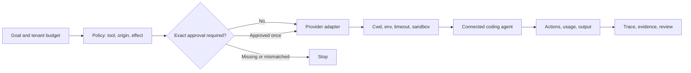

# Governing External Coding Agents

Maqam can govern Codex CLI, Claude Code, another command-line agent, an SDK object, or a remote connector when that worker is routed through a registered adapter. Maqam controls the boundary around the worker: launch settings, working directory, inherited environment, policy, approvals, runtime, output, usage records, and downstream workflow access.

Maqam cannot control a process that bypasses its gateway. It also cannot replace a container, virtual machine, operating-system account, or provider permission system.

## Governance Model



Preventive controls run before or during execution. Observed controls inspect provider events after they occur. Keep that distinction in security reviews.

## Prerequisites

- Node.js 20 or newer.
- `maqam` installed in the project.
- The provider CLI installed and authenticated through its own supported login flow.
- A trusted Git working directory for coding-agent runs.
- A container or virtual machine when the host itself must be isolated.

Do not put credentials in prompts, workflow inputs, evidence excerpts, or source control. The built-in provider adapters pass only a narrow environment allowlist and the provider's own authentication variable when present.

## Codex CLI

The Codex adapter uses non-interactive execution, JSON Lines events, an ephemeral session, and a read-only sandbox by default.

```js
import {
  AgentRuntime,
  EvidenceLedger,
  PolicyEngine,
  ToolGateway,
  createCodexAgentTool
} from "maqam";

const evidenceLedger = new EvidenceLedger();
const policyEngine = new PolicyEngine({
  allowedTools: ["codeReview"],
  maxToolCalls: 1,
  defaultLimits: { maxRuntimeMs: 120_000 }
});
const toolGateway = new ToolGateway({ policyEngine, evidenceLedger });

toolGateway.registerTool("codeReview", createCodexAgentTool({
  cwd: process.cwd(),
  sandbox: "read-only",
  timeoutMs: 90_000,
  maxInputTokens: 1_000,
  maxOutputTokens: 16_000,
  maxTotalTokens: 50_000,
  includeEvents: true
}));

const runtime = new AgentRuntime({ policyEngine, evidenceLedger, toolGateway });
const result = await runtime.runWorkflow({
  tasks: [{
    id: "review",
    run: (context) => context.tools.call("codeReview", {
      prompt: "Review the current diff. Do not modify files. Return the three highest-risk findings."
    }, context)
  }]
}, {
  runId: "review_2026_07_12",
  objective: "Review the current change without edits.",
  allowedTools: ["codeReview"],
  budget: { maxToolCalls: 1, maxRuntimeMs: 90_000 }
});

console.log(result.outputs.review.output);
console.log(result.outputs.review.usage);
console.log(result.outputs.review.activity);
```

Default controls:

| Control | Default |
| --- | --- |
| Sandbox | `read-only` |
| Approval policy inside the CLI | `never`, bounded by the selected sandbox |
| Session persistence | Disabled with an ephemeral run |
| User CLI config | Ignored; authentication remains available |
| Project execution rules | Preserved |
| Shell wrapper | Disabled |
| Environment | System essentials plus `CODEX_HOME` and `CODEX_API_KEY` |

Set `sandbox: "workspace-write"` only for a workflow whose write effect is approval-gated. `danger-full-access` is rejected unless `allowDangerFullAccess: true` is also set. Even then, use it only inside a dedicated external sandbox.

On Windows hosts configured for the elevated Codex sandbox, an isolated automation run can pass `configOverrides: ['windows.sandbox="elevated"']` while still ignoring the rest of the user config. Configuration overrides are trusted operator input and must never come from a workflow prompt.

Current Codex non-interactive behavior and flags are documented in the [official Codex non-interactive guide](https://developers.openai.com/codex/noninteractive).

If the CLI's built-in default is not available to the authenticated account, set the adapter's `model` option to a model listed for that account. The smoke example reads `MAQAM_CODEX_MODEL` for this purpose without changing the normal CLI configuration.

## Claude Code

The Claude Code adapter uses print mode with streaming JSON, plan mode, no tools, no session persistence, a turn ceiling, and a spend ceiling by default.

```js
import { PolicyEngine, ToolGateway, createClaudeCodeAgentTool } from "maqam";

const policyEngine = new PolicyEngine({ allowedTools: ["architectureReview"] });
const toolGateway = new ToolGateway({ policyEngine });

toolGateway.registerTool("architectureReview", createClaudeCodeAgentTool({
  cwd: process.cwd(),
  permissionMode: "plan",
  tools: ["Read", "Glob", "Grep"],
  disallowedTools: ["mcp__*", "Bash", "Edit", "Write"],
  maxTurns: 2,
  maxBudgetUsd: 0.25,
  maxTotalTokens: 50_000,
  timeoutMs: 90_000
}));

const result = await toolGateway.call("architectureReview", {
  prompt: "Map the request path through this repository without changing files."
}, {
  runId: "architecture_review",
  limits: { maxToolCalls: 1 }
});

console.log(result.output);
console.log(result.usage);
```

Default controls:

| Control | Default |
| --- | --- |
| Permission mode | `plan` |
| Built-in tools | None |
| MCP tools | Denied with `mcp__*` and strict MCP configuration |
| Max turns | `3` |
| Max spend | USD `0.25` |
| Session persistence | Disabled |
| Environment | System essentials plus `CLAUDE_CONFIG_DIR` and `ANTHROPIC_API_KEY` |

`bypassPermissions` is rejected unless `allowDangerousPermissions: true` is also set. Prefer explicit read or write tools and keep provider permissions narrower than the Maqam policy.

Current flags are documented in the [official Claude Code CLI reference](https://code.claude.com/docs/en/cli-usage).

## Write Mode With Human Approval

An approval is tied to the exact run id, tool name, and input hash. It is consumed once unless it was explicitly created as reusable.

```js
import {
  AgentRuntime,
  ApprovalQueue,
  PolicyEngine,
  ToolGateway,
  createCodexAgentTool
} from "maqam";

const approvalQueue = new ApprovalQueue();
const policyEngine = new PolicyEngine({
  allowedTools: ["builder"],
  approvalRequiredEffects: ["write"],
  maxToolCalls: 1
});
const toolGateway = new ToolGateway({ policyEngine, approvalQueue });

toolGateway.registerTool("builder", createCodexAgentTool({
  cwd: process.cwd(),
  sandbox: "workspace-write",
  timeoutMs: 120_000
}));

const runtime = new AgentRuntime({ policyEngine, toolGateway, approvalQueue });
const workflow = {
  tasks: [{
    id: "build",
    run: (context) => context.tools.call("builder", {
      prompt: "Create src/example.js and its focused test. Do not publish or access the network."
    }, context)
  }]
};
const goal = {
  runId: "build_example_1",
  objective: "Create one reviewed example.",
  allowedTools: ["builder"],
  budget: { maxToolCalls: 1, maxRuntimeMs: 120_000 }
};

const pendingRun = await runtime.runWorkflow(workflow, goal);
const request = pendingRun.error.details.approvalRequests[0];

approvalQueue.approve(request.approvalId, {
  decidedBy: "package-owner",
  note: "Approved only for this exact workspace edit."
});

const completedRun = await runtime.runWorkflow(workflow, {
  ...goal,
  approvalId: request.approvalId
});

console.log(completedRun.status);
```

Changing the prompt, run id, or tool invalidates that approval. Reusing the consumed approval also fails closed.

## Generic Command-Line Agents

Use `createCliAgentTool` when a provider-specific adapter is not available.

```js
import { createCliAgentTool } from "maqam";

const worker = createCliAgentTool({
  name: "custom-agent",
  command: "/absolute/path/to/agent",
  args: ["run", "--jsonl"],
  cwd: process.cwd(),
  allowedCwdRoots: [process.cwd()],
  envAllowlist: ["PATH", "HOME", "USERPROFILE", "CUSTOM_AGENT_TOKEN"],
  stdin: "text",
  parseJsonLines: true,
  timeoutMs: 60_000,
  maxInputTokens: 1_000,
  maxOutputTokens: 16_000,
  maxOutputBytes: 1_048_576
});
```

Keep the command and arguments fixed in trusted configuration. Pass user prompts over stdin. Shell execution requires the explicit `allowUnsafeShell: true` option and should be avoided for agent input.

## Limit Semantics

| Limit | Enforcement |
| --- | --- |
| Tenant `maxToolCalls` | Hard, before another gateway call starts |
| Tenant `maxRuntimeMs` | Hard outer deadline with cancellation sent to the child process |
| CLI `maxInputTokens` | Hard pre-run approximation based on input bytes |
| CLI `maxOutputTokens` | Hard streaming approximation across stdout and stderr |
| CLI `maxOutputBytes` | Hard streaming byte ceiling |
| Provider `maxTotalTokens` | Post-run observed ceiling; over-budget output is blocked from downstream tasks |
| Claude Code `maxTurns` | Provider-enforced turn ceiling |
| Claude Code `maxBudgetUsd` | Provider-enforced spend ceiling plus Maqam post-check |

Codex CLI currently reports token use in its completion event but does not expose a hard token-budget flag. A hard model-token ceiling requires a provider API or proxy that supports one. Maqam still enforces runtime and output ceilings while the process is running, then blocks downstream use if observed token usage exceeds `maxTotalTokens`.

A post-run budget failure does not roll back an already permitted file change or command. The error includes normalized activity and `sideEffectsMayHaveOccurred`; inspect the workspace and apply an explicit rollback policy before continuing.

## Outcome Validation

A zero process exit means the provider session ended normally. It does not prove that the requested artifact exists or that its contents are correct.

- Use `expectedOutput` for an exact string or regular-expression check on the final provider message.
- Use `requireFileChanges: true` for Codex write tasks that must report at least one file change.
- Use `minToolCalls` for Claude Code tasks that must report tool activity.
- Add a later workflow task that reads the expected artifact, validates its schema or content, runs focused tests, and fails with `AGENT_OUTCOME_VALIDATION_FAILED` when the result is wrong.
- Keep publish, send, deploy, or merge tools in later approval-gated tasks so a failed verifier cannot reach them.

Provider activity checks are observed controls. Artifact inspection and tests are the stronger proof of the desired result.

## What Maqam Records

- Workflow task status, attempts, timestamps, and errors.
- Gateway decisions for allowed, denied, approval-required, completed, and failed calls.
- Redacted tool inputs; common credential fields and token-shaped strings are removed.
- Provider session id, final output, action counts, usage, process duration, exit status, and configured limits.
- Evidence and claims explicitly added by the workflow.
- Approval request, human decision, exact scope, and consumption record.

Provider event streams may contain repository paths, command text, source fragments, or model output. Store them according to the repository's data classification and retention policy. Set `includeEvents: false` when only normalized usage and the final output are needed.

## Security Boundary

Maqam provides an orchestration and governance boundary, not a universal host-security boundary.

- An unregistered process is outside Maqam control.
- A provider can perform internal actions that Maqam sees only in the provider event stream.
- Provider sandboxes and permission modes must stay enabled.
- A child process may call another service using credentials you explicitly pass to it.
- Read-only does not mean data cannot leave the machine if network access remains available.
- The local console binds to `127.0.0.1` and intentionally does not expose a route that launches coding agents.
- Use a container, virtual machine, restricted operating-system account, and network egress policy for high-risk or untrusted code.

## Operational Checklist

1. Register only known adapters.
2. Declare tool effects such as `read`, `write`, `publish`, `send`, or `billing`.
3. Deny effects that the workflow never needs.
4. Require exact human approval for write, publish, send, billing, account, or production effects.
5. Set tenant tool-call and runtime ceilings.
6. Set provider sandbox, permission, turn, spend, input, and output limits.
7. Pass only the environment keys the provider needs.
8. Keep prompts out of command arguments and shells.
9. Inspect the trace, provider activity, repository diff, tests, and evidence before the next side effect.
10. Use external host isolation for untrusted tasks.
