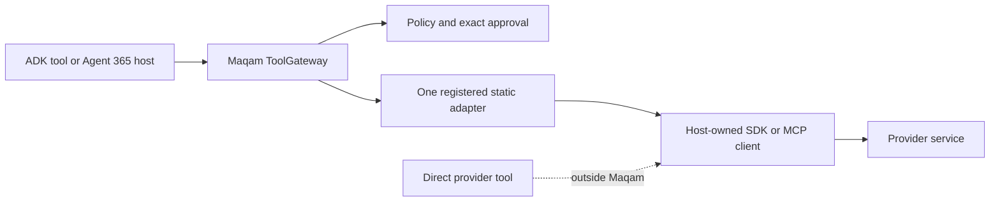

# Google ADK and Microsoft Agent 365

This guide describes the integration boundary Maqam can support today for Google Agent Development Kit (ADK) and Microsoft Agent 365. It deliberately separates repository-tested Maqam behavior from provider-specific examples that have not been exercised against a Google account, Microsoft tenant, or live MCP server.

## Status at a glance

| Surface | Status | Exact claim |
| --- | --- | --- |
| Maqam `defineToolAdapter()`, `registerToolAdapter()` and `ToolGateway` routing | Tested in this repository | A registered host function can be routed through Maqam policy, approval, trace and evidence capabilities. |
| Google ADK `FunctionTool` calling a Maqam gateway | Illustrative; not provider-tested here | The documented ADK `execute` callback provides a place for an application to call a registered Maqam tool. |
| Google ADK Tool Confirmation synchronized with Maqam approval | Not implemented | The application would need a durable correlation bridge that preserves the same run, tool, input and Maqam approval id across pause and resume. |
| Microsoft Agent 365 SDK operation wrapped by a Maqam adapter | Illustrative; not provider-tested here | An explicitly callable SDK operation can be invoked inside a static Maqam adapter. |
| Microsoft Work IQ tools automatically governed by Maqam | Not implemented | Agent 365's automatic tool registration does not route later tool calls through Maqam. |
| Native MCP client, server, discovery or authentication | Not supplied by Maqam | `transport: "mcp"` is a descriptive adapter label, not a protocol implementation. |

The Maqam adapter contract is exercised by `test/framework/tool-adapter.test.js`. The deterministic example in `examples/tool-adapter-ecosystem.mjs` uses local fixture clients and performs no Google, Microsoft, HTTP or MCP request.

## The boundary that applies to both providers



Maqam governs only the solid path in this diagram. The host still owns provider installation, credentials, identity, client lifecycle, discovery, timeouts, retries, rate limits, network policy, output validation and durable storage.

Do not put access tokens, client secrets or provider credentials in model-controlled adapter input, approval payloads, trace metadata or evidence. Resolve them from trusted host configuration inside the adapter.

## Google ADK

Google documents TypeScript `FunctionTool` instances with a Zod parameter schema and an `execute` callback. That callback can delegate the operation to `ToolGateway`. See the official [ADK TypeScript quickstart](https://adk.dev/get-started/typescript/) and [function-tool documentation](https://adk.dev/tools-custom/function-tools/).

### Prerequisites

The current Google TypeScript quickstart specifies Node.js 24.13.0 or later and npm 11.8.0 or later. That is stricter than Maqam's own Node.js requirement, so use Google's higher requirement for a combined project.

Create an ESM project and install the documented ADK packages plus Maqam and Zod:

```bash
mkdir maqam-adk-example
cd maqam-adk-example
npm init --yes
npm pkg set type=module
npm install maqam @google/adk zod
npm install --save-dev @google/adk-devtools typescript
```

Set `GEMINI_API_KEY` using your normal secret-management path. Do not commit a `.env` file containing the key.

### Copy-paste TypeScript example

The example is intentionally local: it proves the ADK-to-Maqam call shape without writing to an external system. Replace only the adapter's `invoke` function when connecting a host-owned SDK client.

Create `agent.ts`:

```ts
import { randomUUID } from "node:crypto";
import { FunctionTool, LlmAgent } from "@google/adk";
import { z } from "zod";
import {
  PolicyEngine,
  ToolGateway,
  defineToolAdapter,
  registerToolAdapter
} from "maqam";

type DraftInput = {
  title: string;
  body: string;
};

type DraftRecord = DraftInput & {
  id: string;
  status: "queued";
};

// This array represents a host-owned local service for the runnable example.
// A production application would construct and authenticate its SDK client here.
const drafts: DraftRecord[] = [];

const adapter = defineToolAdapter<DraftInput, DraftRecord>({
  name: "adk.draft.queue",
  transport: "function",
  description: "Queue one local draft through a governed host function.",
  effects: ["local:write"],
  risk: "medium",
  async invoke(input) {
    const record: DraftRecord = {
      id: `draft_${drafts.length + 1}`,
      status: "queued",
      title: input.title,
      body: input.body
    };
    drafts.push(record);
    return record;
  }
});

const gateway = new ToolGateway({
  policyEngine: new PolicyEngine({
    allowedTools: [adapter.name]
  })
});

registerToolAdapter(gateway, adapter);

const queueDraft = new FunctionTool({
  name: "queue_draft",
  description: "Queue a draft after Maqam policy evaluation.",
  parameters: z.object({
    title: z.string().min(1).describe("Short draft title."),
    body: z.string().min(1).describe("Draft body.")
  }),
  execute: async (input) =>
    gateway.call(adapter.name, input, {
      runId: `adk_${randomUUID()}`
    })
});

export const rootAgent = new LlmAgent({
  name: "maqam_adk_example",
  model: "gemini-flash-latest",
  description: "Demonstrates an ADK FunctionTool routed through Maqam.",
  instruction:
    "When asked to queue a draft, call queue_draft once and report its returned id.",
  tools: [queueDraft]
});
```

Run it using Google's documented development CLI:

```bash
npx adk run agent.ts
```

Provider status: this code follows the documented Google API shape, but it is not part of Maqam's automated test matrix and has not been run here with a Gemini key. `adk web` is documented by Google as a development and debugging interface, not a production deployment.

### Replacing the local function with an SDK call

Keep client creation and authentication outside model input. Give each operation a static adapter name:

```ts
const createIssueAdapter = defineToolAdapter({
  name: "adk.issue.create",
  transport: "sdk",
  description: "Create one issue through the configured host SDK.",
  effects: ["network:write"],
  risk: "high",
  invoke: (input) => issueClient.issues.create(input)
});
```

`issueClient` is intentionally host-supplied; Maqam does not install it, authenticate it or validate its response. Define a narrow input schema in the ADK `FunctionTool`, register this adapter, and call the same static adapter name from `execute`.

### Exact approval correlation is a separate integration

The runnable example creates a new Maqam run id for every tool call and configures no approval requirement. That is sufficient for the allow/deny demonstration. It is not a pause-and-resume approval bridge.

Google labels ADK Tool Confirmation experimental. In TypeScript, confirmation is implemented manually inside the tool's `execute` callback with `ToolContext`. For remote confirmation, Google requires the response id to match the original function-call id; when ADK resume is enabled, the invocation id must also match. See [ADK action confirmations](https://adk.dev/tools-custom/confirmation/).

An exact bridge must persist all of the following as one correlation record:

```ts
type AdkMaqamApprovalCorrelation = {
  adkInvocationId: string;
  adkFunctionCallId: string;
  maqamRunId: string;
  maqamToolName: string;
  maqamApprovalId: string;
  canonicalInput: unknown;
};
```

Its lifecycle must be:

1. Call Maqam with a stable `maqamRunId`, static tool name and the candidate input.
2. Catch `ApprovalRequiredError` and retain the pending Maqam approval id plus the exact input used for that call.
3. Present the actual operation and input to the approver through ADK's confirmation flow. Do not treat a model-generated statement as approval.
4. Correlate the ADK confirmation response to the same ADK function call and invocation.
5. On a trusted positive decision, approve the Maqam request and retry `ToolGateway.call()` with the same Maqam run id, tool name, exact input and `approvalId`.
6. Reject on changed input, missing correlation, an untrusted decision source, expiry, replay or provider resume mismatch.
7. Persist and reconcile the mapping when process-local state is insufficient.

Maqam implements the exact gateway side of steps 1, 2, 5 and 6. It does not currently implement the ADK state store, confirmation UI, provider event mapping or recovery logic. Until that bridge has provider-specific tests, publish the integration as `FunctionTool` routing, not as native ADK exact approval.

### Direct `MCPToolset` bypass warning

Google documents `MCPToolset` as establishing the MCP connection, discovering remote tools, adapting them to ADK tools and exposing them to the agent. See [ADK MCP tools](https://adk.dev/tools-custom/mcp-tools/).

If an application places `new MCPToolset(...)` directly in an ADK agent's `tools` list, calls through those discovered tools do not enter Maqam's registered gateway. Maqam cannot honestly claim to govern them.

To add Maqam to that path, the application needs a host-owned MCP client and one static Maqam adapter for each intended remote operation. Do not accept an arbitrary remote tool name from model-controlled input, because that would hide many different effects behind one policy identity.

## Microsoft Agent 365

Microsoft describes Agent 365 as a layer for identity, observability, notifications, security and governed Microsoft 365 tool access around agents built with other frameworks. It does not create or host the agent itself. See the official [Agent 365 developer overview](https://learn.microsoft.com/en-us/microsoft-agent-365/developer/) and [SDK overview](https://learn.microsoft.com/en-us/microsoft-agent-365/developer/agent-365-sdk).

Maqam does not replace Microsoft Entra identity, agent blueprints, tenant consent, Purview, Defender, Work IQ permissions, Agent 365 publishing or OpenTelemetry. Those remain separate Microsoft and tenant controls.

### Prerequisites

For the tooling path, Microsoft currently documents:

- the Agent 365 CLI and project configuration;
- .NET 8 or later for the CLI prerequisites;
- a configured agent identity or supported on-behalf-of flow;
- a Global Administrator for tenant service-principal setup and MCP permissions;
- `ToolingManifest.json`, generated by `a365 develop add-mcp-servers`;
- an explicit admin permissions step through `a365 setup all` or `a365 setup permissions mcp`.

Adding a server to `ToolingManifest.json` does not grant its permissions. Follow Microsoft's current [Agent 365 tooling guide](https://learn.microsoft.com/en-us/microsoft-agent-365/developer/tooling) rather than copying tenant ids, scopes or audience values from an example.

For local integration work, Microsoft recommends its mock tooling server:

```bash
a365 develop start-mock-tooling-server
```

Then configure the documented local endpoint for that development process:

```text
MCP_PLATFORM_ENDPOINT=http://localhost:5309
```

### Copy-paste TypeScript discovery wrapper

This example wraps the documented JavaScript `McpToolServerConfigurationService.listToolServers()` SDK operation. It governs only the discovery call. It does not govern any tool returned by that call.

Create a project:

```bash
mkdir maqam-agent365-example
cd maqam-agent365-example
npm init --yes
npm pkg set type=module
npm install maqam @microsoft/agents-a365-tooling
npm install --save-dev typescript tsx @types/node
```

Create `agent365-discovery.ts`:

```ts
import { randomUUID } from "node:crypto";
import { McpToolServerConfigurationService } from "@microsoft/agents-a365-tooling";
import {
  PolicyEngine,
  ToolGateway,
  defineToolAdapter,
  registerToolAdapter
} from "maqam";

function requiredEnvironment(name: string): string {
  const value = process.env[name];
  if (!value) throw new Error(`${name} is required.`);
  return value;
}

// Identity and credentials are trusted host configuration. They are not part
// of model-controlled adapter input, Maqam evidence or approval payloads.
const agentUserId = requiredEnvironment("AGENT365_AGENT_USER_ID");
const configurationService = new McpToolServerConfigurationService();

async function getAccessToken(): Promise<string> {
  return requiredEnvironment("AGENT365_AUTH_TOKEN");
}

const adapter = defineToolAdapter({
  name: "agent365.tool_servers.list",
  transport: "sdk",
  description: "List configured Agent 365 MCP tool servers.",
  effects: ["network:read"],
  risk: "medium",
  async invoke() {
    const authToken = await getAccessToken();
    return configurationService.listToolServers(agentUserId, authToken);
  }
});

const gateway = new ToolGateway({
  policyEngine: new PolicyEngine({
    allowedTools: [adapter.name]
  })
});

registerToolAdapter(gateway, adapter);

const servers = await gateway.call(
  adapter.name,
  {},
  { runId: `agent365_discovery_${randomUUID()}` }
);

console.log(JSON.stringify(servers, null, 2));
```

Provide short-lived development credentials through your shell or secret manager, then run:

```bash
npx tsx agent365-discovery.ts
```

Provider status: the method and package names follow Microsoft's documented JavaScript example. Maqam's repository has not installed these packages, authenticated to a tenant, started Microsoft's mock server or executed this provider call. Test against the mock server first, then run a restricted tenant integration test with the required admin permissions.

A production host should replace the environment lookup with its scoped, short-lived token provider, protect the returned token in memory and prevent provider and application logs from recording it.

### `addToolServersToAgent()` bypass warning

Microsoft documents framework-specific `addToolServersToAgent()` extensions that load configured MCP servers, register their tools with an orchestrator, configure authentication and make the tools available for later invocation. The JavaScript example currently targets LangChain.

Wrapping the one-time `addToolServersToAgent()` registration call with Maqam would govern only registration. It would not govern the later dynamically registered tool calls. Those calls do not enter a Maqam adapter automatically.

Therefore Maqam must not claim automatic Work IQ or Agent 365 tool governance. A real per-call integration needs one of these additional implementations:

1. a documented provider/orchestrator interception point that routes every generated tool call through a static Maqam adapter; or
2. a host-owned MCP client where each allowed remote operation is represented by its own registered Maqam adapter.

Neither implementation is shipped today. Microsoft also marks the [Work IQ MCP surface as preview](https://learn.microsoft.com/en-us/microsoft-agent-365/tooling-servers-overview) and says preview features are not intended for production use.

### Approval and observability remain separate

Maqam approval does not grant Microsoft tenant permission, activate an agent blueprint, approve an MCP server in the Microsoft 365 admin center or create an Agent 365 audit event. Conversely, Microsoft identity or admin consent does not satisfy a configured Maqam exact-call approval.

If both systems are used, the application must define:

- a stable cross-system correlation id;
- which human or administrative decision satisfies which policy;
- how Maqam run, approval, trace and evidence identifiers map to provider invocation ids;
- how OpenTelemetry spans relate to Maqam traces without treating one as the other;
- persistence, idempotency, retry and reconciliation behavior;
- redaction rules that prevent credentials and Microsoft 365 content from entering unsafe logs or evidence.

No automatic Agent 365 OpenTelemetry exporter or approval synchronizer is included in Maqam.

## MCP protocol responsibilities

The latest stable [MCP tools specification](https://modelcontextprotocol.io/specification/2025-11-25/server/tools) defines real tool discovery through `tools/list` and invocation through `tools/call`. Maqam's generic adapter implements neither message. It invokes a host function that may call an MCP client.

The same specification assigns input validation, access control, rate limiting and output sanitation to servers, and recommends client confirmation, result validation, timeouts and audit logging. Remote authorization additionally has discovery, audience validation, PKCE, token-storage and HTTPS requirements in the [MCP authorization specification](https://modelcontextprotocol.io/specification/2025-11-25/basic/authorization). A passing Maqam adapter conformance probe does not certify any of those protocol or transport controls.

## Safe public wording

Use this wording in release material:

> Maqam is framework-neutral. A host application can expose a registered Maqam operation as a Google ADK `FunctionTool`, or wrap an explicitly callable Microsoft Agent 365 SDK or MCP-client operation. Only calls routed through that static `ToolGateway` adapter are governed. Maqam does not supply provider authentication, discovery, protocol clients, tenant controls or automatic provider approval synchronization. The Google and Microsoft examples are integration templates, not official partnerships or provider certifications.

Avoid these statements:

- "Native Google ADK integration";
- "Native Microsoft Agent 365 or Work IQ integration";
- "MCP compatible" without an actual protocol implementation and protocol tests;
- "All ADK, Agent 365 or MCP tools are governed";
- "Maqam replaces Entra, Purview, Defender, provider approvals or OpenTelemetry";
- "Production-ready Work IQ integration" while the cited Microsoft surface remains preview.

## Official sources

- Google ADK: [TypeScript quickstart](https://adk.dev/get-started/typescript/), [function tools](https://adk.dev/tools-custom/function-tools/), [action confirmations](https://adk.dev/tools-custom/confirmation/), [MCP tools](https://adk.dev/tools-custom/mcp-tools/).
- Microsoft Agent 365: [developer overview](https://learn.microsoft.com/en-us/microsoft-agent-365/developer/), [SDK overview](https://learn.microsoft.com/en-us/microsoft-agent-365/developer/agent-365-sdk), [tooling guide](https://learn.microsoft.com/en-us/microsoft-agent-365/developer/tooling), [Work IQ MCP preview](https://learn.microsoft.com/en-us/microsoft-agent-365/tooling-servers-overview).
- Model Context Protocol: [tools specification](https://modelcontextprotocol.io/specification/2025-11-25/server/tools), [authorization specification](https://modelcontextprotocol.io/specification/2025-11-25/basic/authorization), [security best practices](https://modelcontextprotocol.io/docs/tutorials/security/security_best_practices).
