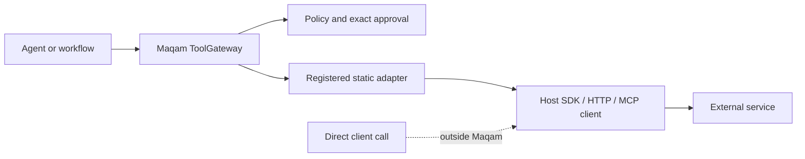

# Host-supplied tool adapters

Maqam can place a policy and approval boundary around a function, SDK call, HTTP transport, or MCP-style client call when the application routes that call through a registered `ToolGateway` adapter.

That sentence defines the boundary. Maqam does not bundle provider SDKs, an MCP client or server, MCP discovery, protocol authentication, an HTTP service client, a connector marketplace, secret storage, or an automatic ProductLoop transaction bridge. Calls that use those clients directly bypass Maqam.

For provider-specific prerequisites, runnable templates and explicit bypass warnings, see [Google ADK and Microsoft Agent 365](integrations-google-adk-agent365.md).

## What is implemented

| Surface | Maqam supplies | Host application supplies |
| --- | --- | --- |
| Function | Descriptor, registration, policy, trace and evidence capability | Function implementation |
| SDK | The same governed adapter boundary | Installed SDK, configured client, credentials and retries |
| HTTP | The same governed adapter boundary and input-origin policy evaluation | HTTP client, authentication, redirect/DNS controls, rate limits and response validation |
| MCP-style | A static local adapter name and governed invocation | MCP client, connection, discovery, protocol validation, authentication and remote tool arguments |
| ProductLoop OS | Compatibility with its exposed `maqamGateway` | Explicit registration, record correlation, persistence and failure recovery |

The `transport` field is a descriptive label. It does not activate a protocol implementation.



## Adapter contract

Define the tool name, transport label, description, effects, risk and invocation explicitly:

```js
import {
  PolicyEngine,
  ToolGateway,
  defineToolAdapter,
  registerToolAdapter
} from "maqam";

const adapter = defineToolAdapter({
  name: "function.slug",
  transport: "function",
  description: "Create a URL slug without external I/O.",
  effects: [],
  risk: "low",
  invoke: async ({ value }) => ({
    slug: value.toLowerCase().replaceAll(" ", "-")
  })
});

const gateway = new ToolGateway({
  policyEngine: new PolicyEngine({ allowedTools: [adapter.name] })
});
registerToolAdapter(gateway, adapter);

const output = await gateway.call(
  "function.slug",
  { value: "Maqam Release" },
  { runId: "release_1" }
);
```

`effects` is required. Use `[]` only for a pure adapter. An adapter is rejected if extra metadata tries to redefine `effects`, `risk`, or adapter identity. Those top-level fields remain the registration authority seen by policy.

Inputs still use the `ToolGateway` canonical JSON boundary. The invoked adapter receives the detached, deeply frozen input that policy evaluated. A class prototype method must be explicitly bound before it is assigned to `invoke`.

Adapter output is returned as the trusted adapter provides it; defining an adapter does not automatically validate or record output as evidence. Use the scoped `context.evidence` capability inside the adapter when a workflow needs explicit evidence records.

## SDK-style invocation

The SDK client is constructed and authenticated by the application:

```js
const issueAdapter = defineToolAdapter({
  name: "sdk.issue.create",
  transport: "sdk",
  description: "Create an issue through the configured SDK client.",
  effects: ["network:write"],
  risk: "high",
  invoke: (input) => issueSdk.issues.create(input)
});

registerToolAdapter(gateway, issueAdapter);
```

Do not put API tokens in adapter input or evidence. Resolve credentials in trusted host configuration and ensure application logging does not expose them.

## HTTP-style invocation

Keep the destination in canonical input so policy can inspect its origin, then check the effective origin scope inside the adapter:

```js
const httpAdapter = defineToolAdapter({
  name: "http.release.enqueue",
  transport: "http",
  description: "Queue a release through a configured HTTP transport.",
  effects: ["network:write", "release:queue"],
  risk: "high",
  async invoke(input, context) {
    const origin = new URL(input.endpoint).origin;
    if (!context.authorizedOrigins.includes(origin)) {
      throw new Error(`Origin '${origin}' was not authorized.`);
    }
    return httpClient.request({
      method: "POST",
      url: input.endpoint,
      json: { release: input.release }
    });
  }
});
```

The generic adapter does not make an arbitrary HTTP client SSRF-safe. The host must constrain redirects, DNS resolution, proxies, private networks, response bytes, retries and deadlines. Use Maqam's built-in crawler when its public-network, redirect, DNS-pinning, robots and byte-limit controls fit the read-only research use case.

## MCP-style invocation

Register one static local adapter for one intended remote tool. Do not let untrusted input select an arbitrary remote tool name, because that would collapse multiple effects behind one policy identity.

```js
const mcpAdapter = defineToolAdapter({
  name: "mcp.github.create_issue",
  transport: "mcp",
  description: "Call one configured MCP tool through the host client.",
  effects: ["network:write"],
  risk: "high",
  invoke: (input) => mcpClient.callTool({
    name: "create_issue",
    arguments: input
  })
});

registerToolAdapter(gateway, mcpAdapter);
```

This is an MCP-shaped wrapper, not native MCP support. The host owns client lifecycle, capability negotiation, schema validation, authentication, cancellation and protocol errors. Provider-internal actions remain subject to the provider's own permissions and sandbox.

## Machine-readable conformance probe

`runToolAdapterConformance()` performs one adapter invocation through an isolated, allowlisted gateway and returns a frozen JSON-compatible report:

```js
import { runToolAdapterConformance } from "maqam";

const report = await runToolAdapterConformance(adapter, {
  input: { value: "Fixture Value" },
  verifyOutput: (output) => output.slug === "fixture-value"
});

if (!report.passed) process.exitCode = 1;
console.log(JSON.stringify(report, null, 2));
```

The report checks:

- registration and allowlisted policy routing;
- one invocation;
- delivery of the frozen canonical input;
- delivery of adapter metadata;
- a completed gateway trace;
- the optional output predicate.

Run it only against a fixture, emulator or sandbox: the probe invokes the adapter once. A pass is not a protocol certification, security score, production SLA, distributed-systems test or proof that bypass paths are closed.

The repository's deterministic four-shape example emits both results and the conformance report as JSON:

```bash
node examples/tool-adapter-ecosystem.mjs
```

It uses local fixture clients. It performs no external HTTP, SDK or MCP request.

## ProductLoop OS composition

`createProductLoopOS()` already exposes a Maqam subsystem, including `maqamGateway`. Register the same adapter explicitly:

```js
import { createProductLoopOS } from "productloop-os";
import { defineToolAdapter, registerToolAdapter } from "maqam";

const adapter = defineToolAdapter({
  name: "sdk.issue.create",
  transport: "sdk",
  description: "Create an issue through the host SDK.",
  effects: ["network:write"],
  risk: "high",
  invoke: (input) => issueSdk.issues.create(input)
});

const productLoop = createProductLoopOS({
  maqamPolicy: { allowedTools: [adapter.name] }
});
registerToolAdapter(productLoop.maqamGateway, adapter);

const result = await productLoop.maqamGateway.call(
  adapter.name,
  { title: "Review release" },
  { runId: "productloop_release_1" }
);
```

ProductLoop's connector registry, runtime, approvals, provenance and Maqam stores remain distinct. This registration does not copy an `ajnas-connectors` manifest, synchronize approval records, create a shared transaction, or persist either system. If an application needs a cross-system workflow, it must define correlation IDs, mapping rules, idempotency, an outbox or retry policy, and reconciliation behavior explicitly.

## Deployment checklist

1. Give each external operation a static adapter name.
2. Declare every meaningful effect and a non-downgraded risk.
3. Configure the gateway policy before registration.
4. Require exact approval for write, publish, send, billing and production effects.
5. Keep credentials in the host secret mechanism, outside canonical input and evidence.
6. Enforce transport-specific timeouts, size limits, retries, rate limits and network policy.
7. Run the conformance probe against a fixture, then run provider-specific integration tests in a restricted environment.
8. Verify the application has no direct client path that bypasses the adapter.
9. Persist and reconcile run, approval, trace and evidence records when in-process storage is insufficient.
