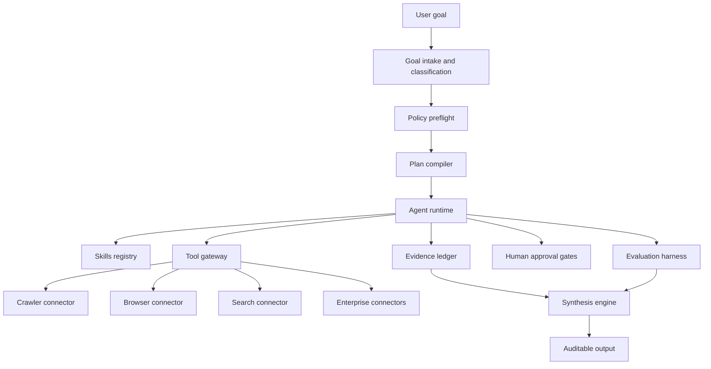

# Maqam Agent Framework Design

> Historical design record (2026-06-28): the package names in this document were proposals, not separate publishable workspaces. The implemented package in this repository is `maqam`; do not create or publish empty packages from this list. Current ProductLoop packages, where applicable, are maintained in their own repository and release process.

## Summary

Maqam should evolve from a respectful crawler package into an agent framework. The crawler remains useful, but it becomes one tool inside a larger system for running governed, auditable, multi-agent workflows. The core product is the framework: runtime, skills, tool gateway, policy engine, evidence ledger, evaluation harness, human approval, and operational observability.

The first build should not attempt to create a full hosted platform. The first build should create a local, testable Node.js framework layer that preserves the existing crawler API and adds enterprise-grade primitives around it.

## Goals

- Provide a reusable agent runtime that can execute typed workflows with clear task state, retries, budgets, and trace events.
- Provide a policy engine that decides whether an agent may use a tool, access a URL or origin, emit output, or require human approval.
- Provide an evidence ledger that records claims, sources, excerpts, timestamps, tool calls, and confidence so research outputs are auditable.
- Provide a skill registry that can install, validate, score, and select agent skills without binding Maqam to one runtime.
- Provide a tool gateway that wraps browser, crawler, search, GitHub, npm, internal docs, and enterprise SaaS connectors behind one governed interface.
- Provide an evaluation harness that checks workflow correctness, citation quality, policy decisions, and regression behavior.
- Keep crawling as a supporting capability for research and ingestion workflows, not as the product identity.

## Non-Goals For The First Build

- Do not build a hosted SaaS control plane yet.
- Do not add stealth scraping, CAPTCHA bypass, paywall bypass, or access-control evasion.
- Do not clone or copy third-party skill catalogs.
- Do not depend on a specific LLM provider in the framework core.
- Do not rename or break the current `ajnas-agent-crawler` package API until a migration package exists.

## Product Shape

Ajnas should ship in layers:

1. `ajnas-agent-runtime`: task graph execution, workflow state, retries, budgets, cancellation, and trace events.
2. `ajnas-policy-engine`: rules for tools, domains, licenses, data sensitivity, tenant controls, and approval gates.
3. `ajnas-evidence-ledger`: provenance records for claims, sources, screenshots, hashes, excerpts, tool calls, and confidence.
4. `ajnas-tool-gateway`: typed connector contract for crawler, browser, search, GitHub, npm, Drive, Slack, Jira, internal docs, and databases.
5. `ajnas-skills-registry`: skill metadata, trigger matching, versioning, linting, dependency graph, compatibility, and eval scores.
6. `ajnas-eval-harness`: deterministic tests for agent workflows, skills, policy, tool calls, and source quality.
7. `ajnas-human-review`: approval queues for risky actions and auditable human decisions.
8. `ajnas-control-plane`: later hosted/admin layer for tenants, keys, roles, workflow templates, observability, and usage.

The current repository can begin as a framework seed by adding the first four layers locally while keeping the crawler as the first tool connector.

## Core Architecture



The runtime owns workflow execution. The policy engine owns permission decisions. The tool gateway owns external actions. The evidence ledger owns provenance. The skills registry owns reusable behavior. This separation keeps the framework testable and prevents every agent workflow from becoming a custom script.

## Enterprise Workflow

### 1. Goal Intake

The system accepts a user goal such as "research OSS agent frameworks", "audit package licenses", "build a workflow spec", or "monitor new npm projects". Intake converts the free-form goal into a structured `AgentGoal` with:

- `goalId`
- `tenantId`
- `requestedBy`
- `objective`
- `riskLevel`
- `dataSensitivity`
- `allowedTools`
- `allowedOrigins`
- `requiredApprovals`
- `budget`
- `outputContract`

### 2. Policy Preflight

Before execution, the policy engine evaluates the goal. It can return:

- `allow`: the workflow can run.
- `deny`: the workflow is blocked with a reason.
- `needs_approval`: a human must approve before execution.
- `limit`: the workflow can run with reduced tools, domains, budget, or output permissions.

Policy is enforced again before every tool call, not only at the start.

### 3. Plan Compilation

The planner converts the goal into a typed task graph. A research workflow may compile into:

- `discover_candidates`
- `filter_licenses`
- `inspect_primary_sources`
- `score_relevance`
- `capture_evidence`
- `review_risks`
- `synthesize_report`
- `run_quality_checks`

Each task has inputs, outputs, timeout, retry limit, required tools, and policy scope.

### 4. Skill Selection

The skills registry resolves skills using metadata:

- trigger phrases
- capability tags
- runtime compatibility
- trust level
- tenant allowlist
- eval score
- dependency requirements
- last verification timestamp

The system should prefer original Ajnas skills and use public skill repositories only as inspiration unless licenses and attribution are verified.

### 5. Tool Execution

Every tool call goes through the tool gateway. The gateway validates:

- tool name
- input schema
- tenant policy
- URL/domain policy
- data sensitivity
- rate limits
- approval requirements
- output redaction rules

The crawler connector is used only when policy allows public web access and the target does not require bypassing access controls.

### 6. Evidence Capture

Every meaningful claim produced by an agent should link to evidence. Evidence records include:

- source URL or connector record ID
- retrieval timestamp
- excerpt or structured result
- content hash where available
- tool name and tool input hash
- agent/task ID
- confidence score
- license or terms notes when relevant

The synthesis stage must prefer claims with evidence and flag unsupported claims.

### 7. Human Approval

Human approval is required for actions such as:

- sending email or messages
- publishing content
- creating PRs or releases
- writing to production systems
- cloning or forking third-party repositories
- using private/customer data in a workflow
- continuing when policy returns ambiguous risk

Approval decisions become evidence events in the run history.

### 8. Evaluation And QA

Every workflow can run checks before final output:

- cited sources are reachable or explainably unavailable
- license filters match the requested license set
- unsupported claims are flagged
- policy denials are respected
- no disallowed tools were used
- no restricted domains were accessed
- output matches the requested schema
- run cost and time stayed within budget

### 9. Synthesis

The final synthesis agent produces structured output using the evidence ledger and eval results. For research reports, the required output shape is:

- candidate name
- URL
- license
- what it does
- why it matters to Ajnas
- risks
- improvement ideas
- fork versus inspiration recommendation
- evidence references

### 10. Audit And Replay

Every run should be replayable enough for enterprise review. The system stores:

- normalized goal
- policy decisions
- task graph
- tool calls
- evidence records
- model/runtime metadata
- approval decisions
- final output
- eval results

The first local implementation can persist these as JSON files. A later enterprise deployment can persist them in Postgres, SQLite, or an event store.

## Data Contracts

### Agent Goal

```json
{
  "goalId": "goal_01",
  "tenantId": "tenant_ajnas",
  "requestedBy": "user",
  "objective": "Research permissive OSS agent frameworks",
  "riskLevel": "medium",
  "dataSensitivity": "public",
  "allowedTools": ["crawler", "search", "github", "npm"],
  "allowedOrigins": ["github.com", "npmjs.com"],
  "requiredApprovals": [],
  "budget": {
    "maxToolCalls": 100,
    "maxRuntimeMs": 600000
  },
  "outputContract": "oss_candidate_report"
}
```

### Policy Decision

```json
{
  "status": "allow",
  "reason": "Public research workflow with approved tools and origins.",
  "limits": {
    "maxToolCalls": 100,
    "maxRuntimeMs": 600000
  },
  "requiredApprovals": []
}
```

### Evidence Record

```json
{
  "evidenceId": "ev_01",
  "runId": "run_01",
  "taskId": "inspect_primary_sources",
  "sourceType": "url",
  "source": "https://github.com/apify/crawlee",
  "retrievedAt": "2026-06-28T10:00:00.000Z",
  "excerpt": "Repository metadata and license information.",
  "hash": "sha256:example",
  "tool": "github",
  "confidence": 0.9
}
```

## First MVP Slice

The first implementation should add framework primitives to the current package without breaking the crawler:

- `src/framework/errors.js`
- `src/framework/policy.js`
- `src/framework/evidence-ledger.js`
- `src/framework/tool-gateway.js`
- `src/framework/skill-registry.js`
- `src/framework/runtime.js`
- `src/framework/research-workflow.js`
- focused `node:test` coverage for each module
- README section explaining Ajnas as a framework seed

This produces a usable local SDK:

```js
import {
  AgentRuntime,
  EvidenceLedger,
  PolicyEngine,
  ToolGateway,
  createResearchWorkflow,
  crawl
} from "ajnas-agent-crawler";
```

The crawler stays available, but agent workflows call it through the gateway.

## Risks

- Scope creep: enterprise platform features can overwhelm the current package. The first slice must stay local and testable.
- Brand mismatch: package name says crawler while product direction is framework. Keep compatibility now, then introduce a new package name after the runtime API stabilizes.
- False compliance confidence: policy checks must be explicit and auditable, not marketing language.
- Agent flakiness: every autonomous step needs contracts, budgets, and evals.
- License risk: public skill repositories can inspire design, but copying content requires strict license and attribution checks.

## Testing Strategy

- Unit test policy decisions with allow, deny, limit, and approval cases.
- Unit test evidence ledger records, claim linking, and unsupported claim detection.
- Unit test gateway policy enforcement before tool execution.
- Unit test runtime task ordering, retries, budget exhaustion, and trace events.
- Unit test research workflow with stubbed tools so tests do not depend on live internet.
- Keep crawler tests unchanged to preserve existing behavior.

## Acceptance Criteria

- Existing crawler CLI and API continue to pass tests.
- New framework exports are available from `src/index.js`.
- A stubbed research workflow can execute through runtime, policy, gateway, and evidence ledger.
- Policy denies disallowed tools and origins before tool execution.
- Evidence records can be attached to synthesized claims.
- Tests run with `npm test` and do not require network access.
