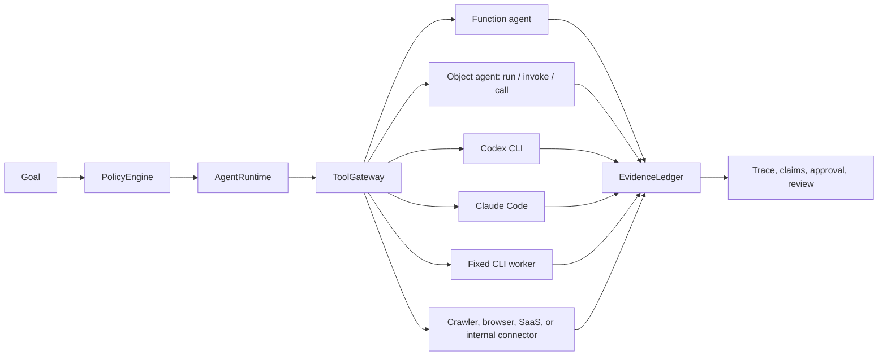

# Maqam Usage Guide

Maqam is an MIT-licensed agent framework for governed workflows. It gives you a small local runtime for building agent systems that can be inspected, policy-checked, and connected to evidence. The crawler is only one built-in connector; Maqam also governs registered functions, objects, command-line agents, and service connectors through stable adapter boundaries.

This guide covers installation, CLI usage, SDK usage, the local console, crawler usage, API reference, common patterns, and troubleshooting.

## Table Of Contents

- [Install](#install)
- [Quick Start](#quick-start)
- [Local Console](#local-console)
- [Crawler CLI](#crawler-cli)
- [Governed Sources](#governed-sources)
- [Framework SDK](#framework-sdk)
- [Architecture](#architecture)
- [API Reference](#api-reference)
- [Build A Custom Workflow](#build-a-custom-workflow)
- [Universal Agent Control](#universal-agent-control)
- [Control Any Agent](#control-any-agent)
- [Control CLI Workers](#control-cli-workers)
- [Govern External Coding Agents](#govern-external-coding-agents)
- [Register A Custom Tool](#register-a-custom-tool)
- [Use Policy And Approvals](#use-policy-and-approvals)
- [Use Evidence And Claims](#use-evidence-and-claims)
- [Use The Skill Registry](#use-the-skill-registry)
- [HTTP API](#http-api)
- [Security And Compliance Notes](#security-and-compliance-notes)
- [Development](#development)
- [Troubleshooting](#troubleshooting)

## Install

Maqam supports the maintained Node.js 22 LTS, 24 LTS, and 26 Current release lines.

Global install:

```bash
npm install -g maqam
```

Project install:

```bash
npm install maqam
```

Run from the cloned repository:

```bash
git clone https://github.com/AjnasNB/maqam.git
cd maqam
npm install
npm test
npm run test:consumer-types
npm run maqam
```

## Quick Start

Start the local web console:

```bash
maqam
```

Open:

```text
http://127.0.0.1:8787
```

Run the crawler CLI:

```bash
maqam-crawl https://example.com --max-pages 10 --jsonl
```

Use the SDK:

```js
import {
  AgentRuntime,
  EvidenceLedger,
  PolicyEngine,
  ToolGateway,
  createAgentTool,
  createClaudeCodeAgentTool,
  createCliAgentTool,
  createCodexAgentTool,
  createCrawlerTool,
  createResearchWorkflow
} from "maqam";

const evidenceLedger = new EvidenceLedger();
const policyEngine = new PolicyEngine({
  allowedTools: ["crawler", "summarizer"],
  allowedOrigins: ["https://github.com"]
});

const toolGateway = new ToolGateway({ policyEngine, evidenceLedger });
toolGateway.registerTool("crawler", createCrawlerTool());
toolGateway.registerTool("summarizer", createAgentTool(async (input) => ({
  summary: `Reviewed ${input.topic}`
}), { name: "summarizer" }));
toolGateway.registerTool("localWorker", createCliAgentTool({
  name: "localWorker",
  command: process.execPath,
  args: ["--version"],
  stdin: "none",
  timeoutMs: 5000,
  maxInputTokens: 20,
  maxOutputBytes: 2048
}));

const runtime = new AgentRuntime({ policyEngine, evidenceLedger, toolGateway });
const result = await runtime.runWorkflow(
  createResearchWorkflow({
    seeds: ["https://github.com/AjnasNB/maqam"],
    maxPages: 3
  }),
  {
    objective: "Research Maqam from public sources",
    allowedTools: ["crawler", "summarizer"],
    allowedOrigins: ["https://github.com"],
    budget: { maxToolCalls: 20, maxRuntimeMs: 120_000 }
  }
);

console.log(result.status);
console.log(result.outputs.synthesize_report.candidates);
console.log(result.evidence);
```

## Local Console

The `maqam` command starts a local browser console for governed research runs.

```bash
maqam
```

Use a custom port:

```bash
maqam --port 8788
```

The console lets you:

- Enter a seed URL.
- Choose the maximum pages to crawl.
- Keep crawling on the same origin or request wider discovery when the server was started with an explicit cross-origin allowlist.
- Run a governed workflow through policy, tool gateway, evidence, runtime, and synthesis.
- Inspect candidates, evidence records, claims, runtime trace, and tool trace.

The console is local by default and binds to `127.0.0.1`.

## Crawler CLI

Maqam includes a crawler because public-source collection is the first governed connector.

```bash
maqam-crawl https://example.com --max-pages 50 --jsonl --output crawl.jsonl
```

Legacy aliases are also available:

```bash
ajnas-crawl https://example.com
ajnas-agent-crawler https://example.com
```

### CLI Options

| Option | Description | Default |
| --- | --- | --- |
| `--max-pages <n>` | Maximum pages to return. | `50` |
| `--max-requests <n>` | Maximum network requests. | budget-derived |
| `--max-depth <n>` | Maximum link depth. | `20` |
| `--max-bytes <n>` | Maximum bytes per response. | `3145728` |
| `--max-duration <ms>` | Maximum total crawl duration. | `600000` |
| `--max-retries <n>` | Retries per request. | `2` |
| `--concurrency <n>` | Concurrent workers. | `4` |
| `--delay <ms>` | Minimum delay per origin. | `250` |
| `--timeout <ms>` | Request timeout. | `15000` |
| `--sitemaps` | Discover URLs from `robots.txt` sitemaps and `/sitemap.xml`. | off |
| `--feeds` | Discover and parse linked RSS and Atom feeds. | off |
| `--max-feed-links <n>` | Maximum feed links discovered per HTML page. | `20` |
| `--max-feed-items <n>` | Maximum entries parsed from one feed. | `100` |
| `--allowed-origin <url>` | Permit one additional HTTP(S) origin; repeat for each origin. | none |
| `--detailed` | Emit `{ pages, failures, stats }`. | off |
| `--stats` | Write crawl statistics as JSON to stderr. | off |
| `--fail-on-error` | Exit with status 2 when non-fatal failures are present. | off |
| `--jsonl` | Output JSON Lines instead of a JSON array. | off |
| `--output <file>` | Write output to a file. | stdout |
| `--user-agent <ua>` | Use a custom user agent. | Maqam default |
| `--version`, `-v` | Print the installed Maqam version. | off |
| `--help` | Show CLI help. | off |

The removed `--all-origins` option is rejected. Name every additional public origin explicitly with repeatable `--allowed-origin` flags. `--detailed` and `--jsonl` cannot be combined.

### Crawler Output

Each crawled page has this shape:

```json
{
  "sourceType": "web",
  "url": "https://example.com/",
  "canonical": "https://example.com/",
  "title": "Example",
  "description": "Example description",
  "h1": "Example",
  "language": "en",
  "text": "Readable text...",
  "markdown": "# Example\n\nReadable markdown...",
  "links": ["https://example.com/about"],
  "feedLinks": ["https://example.com/feed.xml"],
  "fetchedAt": "2026-06-30T00:00:00.000Z",
  "status": 200,
  "contentType": "text/html; charset=utf-8",
  "bytes": 1250,
  "contentHash": "sha256:...",
  "depth": 0,
  "discoveredFrom": null,
  "redirectChain": [],
  "etag": null,
  "lastModified": null,
  "robotsAllowed": true
}
```

When a response is RSS/Atom and feed handling is enabled, `sourceType` is `"feed"` and the page also contains a bounded `feed` record with normalized items and parser provenance.

### Crawler Safety Defaults

The crawler:

- Uses `robots.txt` by default.
- Rate-limits per origin.
- Resolves and validates every destination, rejects embedded URL credentials, and pins each connection to a validated address.
- Re-authorizes every redirect against the origin and network policy.
- Blocks private, loopback, link-local, reserved, multicast, and other special-purpose address ranges by default.
- Limits seeds, requests, queue entries, depth, links, sitemaps, URLs per sitemap, redirects, retries, duration, and response size.
- Avoids non-HTTP URLs.
- Does not bypass login walls, paywalls, CAPTCHA, anti-bot systems, or authorization boundaries.

`allowPrivateNetworks: true` is a trusted local opt-in for supported private ranges. It does not permit link-local metadata endpoints or otherwise unsafe ranges. Robots retrieval fails closed except when the origin definitively returns `404` or `410`.

## Governed Sources

Maqam 0.3 can route one logical research channel across ordered source backends while keeping the selected call at `ToolGateway`:

```js
import {
  PolicyEngine,
  ResearchSourceRegistry,
  ToolGateway,
  createRssAtomSourceAdapter,
  defineResearchToolCaller
} from "maqam";

const source = createRssAtomSourceAdapter(readDocument);
const gateway = new ToolGateway({
  policyEngine: new PolicyEngine({
    allowedTools: [source.toolName],
    allowedOrigins: ["https://feeds.example.com"]
  })
});

gateway.registerTool(source.toolName, source.read, {
  effects: ["network:read"],
  risk: "low"
});

const sources = new ResearchSourceRegistry({
  adapters: [source],
  toolCaller: defineResearchToolCaller({
    call: gateway.call.bind(gateway)
  })
});

const routed = await sources.route({
  channel: "rss-atom",
  input: { url: "https://feeds.example.com/engineering.xml" }
}, { runId: "source_1" });
```

`route()` requires a bound caller. It selects by explicit backend preference, priority, and registration order; invokes `adapter.toolName`; normalizes the result; and records attempts. Policy, approval, authentication/authorization, crawler-security, robots, goal-scope, and call-limit failures are fatal and do not fall through. Ordinary source unavailability may try the next backend.

Authenticated adapters require `allowAuthenticated: true` on the route request. The flag does not acquire or validate credentials. The host owns provider clients, tokens, rate limits, network controls, and permissions.

Use `createWebCrawlerSourceAdapter(createCrawlerTool({...}))` to expose the bounded Maqam crawler as the fixed `research.web-crawler.direct` source tool. The adapter factory adds normalization and source identity only; it has no alternate fetch, login, cookie, or credential path. Register `source.read` at `source.toolName`, declare `network:read`, and keep the crawler's exact origin and budget ceilings in policy and context.

`routeUngoverned()` performs an explicit direct read and normalization without gateway policy, approvals, call ceilings, or trace. Do not call it a governed route.

Run bounded host-defined health checks with `await sources.doctor({ timeoutMs: 2000 })`. Checks report readiness only; timeout cancellation is cooperative, and Maqam cannot prove that arbitrary host code is offline or side-effect free. See [Governed Sources](governed-sources.md) for the full adapter, document, fallback, doctor, RSS/Atom, and security contracts.

## Framework SDK

Install in a project:

```bash
npm install maqam
```

Import the public API:

```js
import {
  AgentRuntime,
  EvidenceLedger,
  PolicyEngine,
  ToolGateway,
  SkillRegistry,
  createAgentTool,
  createCliAgentTool,
  createCrawlerTool,
  createResearchWorkflow,
  crawl,
  crawlDetailed,
  extractPage,
  normalizeUrl,
  discoverSitemapUrls,
  classifyIpAddress,
  isPublicIpAddress,
  resolveUrlTarget,
  MaqamError,
  PolicyDeniedError,
  ApprovalRequiredError,
  toErrorRecord
} from "maqam";
```

Maqam is ESM-only. Use `import`, not `require`.

## Architecture

Maqam is composed from small framework primitives:

```text
User Goal
  -> PolicyEngine.evaluateGoal()
  -> AgentRuntime.runWorkflow()
  -> ToolGateway.call()
  -> EvidenceLedger.addEvidence()
  -> EvidenceLedger.addClaim()
  -> Quality checks
  -> Auditable output
```

Core objects:

- `AgentRuntime`: owns workflow execution.
- `PolicyEngine`: decides what is allowed, denied, or approval-gated.
- `ToolGateway`: routes all external tool calls through policy.
- `createAgentTool`: wraps registered function or object workers so they can use the same gateway.
- `createCliAgentTool`: wraps fixed command-line workers with cwd, environment, cancellation, timeout, token, byte, and JSONL controls.
- `createCodexAgentTool`: applies safe Codex CLI defaults and normalizes JSONL activity and usage.
- `createClaudeCodeAgentTool`: applies safe Claude Code defaults and normalizes stream activity, usage, and cost.
- `EvidenceLedger`: stores source evidence and claim support.
- `SkillRegistry`: stores skill metadata and selects matching skills.
- `createResearchWorkflow`: bundled workflow for public web research.
- `crawl`: lower-level crawler API used by `createCrawlerTool`.

## API Reference

### `new PolicyEngine(config)`

Creates a deterministic policy engine.

```js
const policyEngine = new PolicyEngine({
  allowedTools: ["crawler", "github"],
  deniedTools: ["email"],
  allowedOrigins: ["https://github.com", "https://www.npmjs.com"],
  deniedOrigins: ["https://example-private.local"],
  approvalRequiredTools: ["github"],
  maxToolCalls: 40,
  defaultLimits: {
    maxRuntimeMs: 600_000
  }
});
```

Config fields:

| Field | Type | Description |
| --- | --- | --- |
| `allowedTools` | `string[]` | Tools that may run. An empty list denies all tools unless `allowAllTools` is true. |
| `deniedTools` | `string[]` | Tools that must never run. |
| `allowedOrigins` | `string[]` | URL origins that may be used. An empty list denies URL origins unless `allowAllOrigins` is true. |
| `deniedOrigins` | `string[]` | URL origins that must never be used. |
| `approvalRequiredTools` | `string[]` | Tools that return `needs_approval`. |
| `approvalRequiredEffects` | `string[]` | Tool effects that require approval. |
| `deniedEffects` | `string[]` | Tool effects that must never run. |
| `allowAllTools` | `boolean` | Explicitly allow tools when `allowedTools` is empty. Default: `false`. |
| `allowAllOrigins` | `boolean` | Explicitly allow origins when `allowedOrigins` is empty. Default: `false`. |
| `maxToolCalls` | `number` | Shortcut for default `limits.maxToolCalls`. |
| `defaultLimits` | `object` | Default runtime and tool limits. |

Methods:

```js
policyEngine.evaluateGoal(goal);
policyEngine.authorizeToolCall({ toolName, input, context });
policyEngine.isToolAllowed("crawler");
policyEngine.isOriginAllowed("https://github.com");
policyEngine.authorizationScope(goal);
```

Decision shape:

```json
{
  "status": "allow",
  "reason": "Goal is allowed by policy.",
  "limits": {
    "maxToolCalls": 100,
    "maxRuntimeMs": 600000
  },
  "requiredApprovals": [],
  "scope": {
    "allowedOrigins": ["https://github.com"],
    "originsExplicit": true,
    "originsUnrestricted": false
  }
}
```

Possible statuses:

- `allow`: execution can continue.
- `deny`: execution must stop.
- `needs_approval`: a human approval step is required before continuing.

### `new EvidenceLedger(options)`

Creates an in-memory evidence and claim store.

```js
const evidenceLedger = new EvidenceLedger({
  clock: () => new Date()
});
```

Methods:

```js
const evidence = evidenceLedger.addEvidence({
  runId: "run_1",
  taskId: "collect_sources",
  sourceType: "url",
  source: "https://github.com/AjnasNB/maqam",
  excerpt: "Repository metadata and README excerpt.",
  tool: "crawler",
  confidence: 0.85
});

const claim = evidenceLedger.addClaim({
  runId: "run_1",
  taskId: "synthesize_report",
  text: "Maqam ships a policy engine.",
  evidenceIds: [evidence.evidenceId],
  confidence: 0.8
});

const committed = evidenceLedger.addBatch({
  evidence: [{ source: "https://example.com", excerpt: "Source text" }],
  claims: [{ text: "A checked claim", evidenceIds: [evidence.evidenceId] }]
});

evidenceLedger.listEvidence();
evidenceLedger.listClaims();
evidenceLedger.unsupportedClaims();
evidenceLedger.toJSON();
```

Evidence record shape:

```json
{
  "evidenceId": "ev_1",
  "runId": "run_1",
  "taskId": "collect_sources",
  "sourceType": "url",
  "source": "https://github.com/AjnasNB/maqam",
  "retrievedAt": "2026-06-30T00:00:00.000Z",
  "excerpt": "Repository metadata and README excerpt.",
  "hash": "sha256:...",
  "tool": "crawler",
  "confidence": 0.85
}
```

Evidence ids and claim ids must be unique. Evidence hashes are computed from the normalized source and excerpt; a mismatching caller-supplied hash is rejected. `addBatch()` validates all evidence and claims before a single commit. Internal collections are private, and returned records are detached prototype-safe copies. Unsupported claims are claims with no evidence IDs, missing evidence, or evidence from a different run.

### `new ToolGateway(options)`

Creates a governed tool registry and execution path.

```js
const toolGateway = new ToolGateway({
  policyEngine,
  evidenceLedger
});

toolGateway.registerTool("echo", async (input) => {
  return { value: input.value };
});

const result = await toolGateway.call("echo", { value: "ok" });
```

Methods:

```js
toolGateway.registerTool(name, handler, metadata);
toolGateway.call(toolName, input, context);
toolGateway.trace;
```

Tool handler signature:

```js
async function handler(input, context) {
  return { ok: true };
}
```

The handler context includes:

- `toolName`
- `evidence` and the compatibility alias `evidenceLedger`, both referring to a run/task/tool-scoped facade
- the exact effective `goal`
- `authorizedOrigins` and `authorizationScope` from policy
- safe workflow context passed to `call`

The evidence facade exposes `addEvidence`, `addClaim`, `addBatch`, `listEvidence`, `listClaims`, `unsupportedClaims`, and `toJSON`. Maqam stamps `runId`, `taskId`, and `tool` from the active scope; a handler cannot forge those trusted attribution fields or access the raw ledger.

`ToolGateway` requires a `policyEngine`. For deliberately ungoverned local code only, opt in with `new ToolGateway({ allowUngoverned: true })`.

Handler-declared `effects` and standard `risk` levels are minimum governance metadata. Registration metadata may add effects or raise a standard risk, but it cannot erase handler effects or lower a recognized level. Effects must be non-empty strings. The ordered levels are `low`, `medium`, `high`, and `critical`; non-empty domain-specific risk labels remain supported for compatibility but are not ordered against each other. Malformed or unknown policy decisions fail closed without running the handler.

If policy denies the call, `ToolGateway` throws `PolicyDeniedError`.

If policy requires approval, `ToolGateway` throws `ApprovalRequiredError`.

### `new AgentRuntime(options)`

Creates the workflow runner.

```js
const runtime = new AgentRuntime({
  policyEngine,
  evidenceLedger,
  toolGateway
});
```

Run a workflow:

```js
const result = await runtime.runWorkflow(workflow, goal);
```

Workflow shape:

```js
const workflow = {
  name: "my_workflow",
  tasks: [
    {
      id: "first_task",
      retries: 1,
      retryOn: ["TEMPORARY_UPSTREAM_ERROR"],
      timeoutMs: 5000,
      run: async (context) => {
        return { ok: true };
      }
    }
  ]
};
```

Goal shape:

```js
const goal = {
  runId: "run_custom_1",
  objective: "Research public sources",
  allowedTools: ["crawler"],
  allowedOrigins: ["https://github.com"],
  budget: {
    maxToolCalls: 40,
    maxRuntimeMs: 600_000
  }
};
```

Runtime result shape:

```json
{
  "runId": "run_123",
  "status": "completed",
  "trace": [
    {
      "taskId": "first_task",
      "status": "completed",
      "attempt": 1,
      "startedAt": "2026-06-30T00:00:00.000Z",
      "finishedAt": "2026-06-30T00:00:01.000Z"
    }
  ],
  "outputs": {
    "first_task": {
      "ok": true
    }
  },
  "evidence": {
    "evidence": [],
    "claims": [],
    "unsupportedClaims": []
  }
}
```

`retries` only sets the maximum additional attempts. Retrying is opt-in: set `retryable: true`, provide a `retryOn` error-code array or predicate, or throw an error explicitly marked retryable. Approval, policy, timeout, and other errors are not retried merely because `retries` is nonzero. Tasks receive an `AbortSignal`; timeout results identify when a task did not settle during `cancellationGraceMs` and may still be running.

Task context fields:

- `runId`
- `goal`
- `outputs`
- `evidence`
- `tools`
- `trace`

### `new SkillRegistry()`

Creates a lightweight registry for skill metadata.

```js
const registry = new SkillRegistry();

registry.register({
  id: "oss-research",
  name: "OSS Research",
  version: "0.1.0",
  triggers: ["oss", "github", "agent framework"],
  capabilities: ["research", "synthesis"],
  trustLevel: "verified",
  evalScore: 0.9,
  metadata: {
    owner: "Ajnas NB"
  }
});

const matches = registry.find({
  text: "Research agent framework projects",
  capabilities: ["research"]
});
```

Methods:

```js
registry.register(skill);
registry.get("oss-research");
registry.list();
registry.find({ text, capabilities });
registry.findByCapability("research");
registry.select({ trigger: "oss", capabilities: ["research"] });
```

`register()` returns a normalized copy of the stored skill. `get()`, `list()`, `find()`, `findByCapability()`, and `select()` also return detached copies. Registry storage is private, mutable inputs are snapshotted, unknown/inherited/accessor fields are rejected, and a duplicate id is an error rather than an overwrite. Selection sorts by `evalScore` descending, then by `id`.

### `createCrawlerTool(defaultOptions)`

Wraps the low-level crawler as a `ToolGateway` handler.

```js
const crawlerTool = createCrawlerTool({
  concurrency: 2,
  delayMs: 250,
  timeoutMs: 12_000,
  maxPages: 10,
  allowedOrigins: ["https://example.com"]
});

toolGateway.registerTool("crawler", crawlerTool);
```

When called through the gateway, input is passed to `crawl`:

```js
await toolGateway.call("crawler", {
  seeds: ["https://example.com"],
  maxPages: 5,
  sameOrigin: true,
  includeSitemaps: false
});
```

Tool input can lower configured crawler ceilings but cannot raise them. The effective origin list is the intersection of the tool configuration, workflow goal, and gateway authorization scope. Cross-origin mode requires an explicit trusted origin allowlist. A caller cannot enable private-network access; it must be enabled in trusted `defaultOptions`.

### `createAgentTool(agent, options)`

Wraps an arbitrary agent so it can be controlled by Maqam policy and executed through `ToolGateway`.

Supported agent shapes:

- Function agent: `async (input, context) => output`
- Object agent with `run(input, context)`
- Object agent with `invoke(input, context)`
- Object agent with `call(input, context)`

```js
const summarizer = createAgentTool(async (input, context) => {
  return {
    summary: `Reviewed ${input.topic}`,
    evidence: [
      {
        evidenceId: "ev_agent_1",
        sourceType: "agent_output",
        source: "summarizer",
        excerpt: "The agent reviewed policy and evidence controls.",
        confidence: 0.8
      }
    ],
    claims: [
      {
        text: "The summarizer reviewed policy and evidence controls.",
        evidenceIds: ["ev_agent_1"],
        confidence: 0.8
      }
    ]
  };
}, { name: "summarizer" });

toolGateway.registerTool("summarizer", summarizer);

const result = await toolGateway.call("summarizer", {
  topic: "Maqam"
}, {
  runId: "run_1",
  taskId: "summarize"
});
```

If the agent output includes `evidence` or `claims` arrays, Maqam prevalidates and records the entire set as one atomic batch through the active scoped evidence facade. Object runners must be own data functions; bind class prototype methods explicitly before passing them to `createAgentTool()`.

Object-agent example:

```js
const browserAgent = {
  async run(input) {
    return {
      url: input.url,
      result: "Browser task completed"
    };
  }
};

toolGateway.registerTool("browserAgent", createAgentTool(browserAgent, {
  name: "browserAgent"
}));
```

### `createResearchWorkflow(options)`

Creates the bundled public research workflow.

```js
const workflow = createResearchWorkflow({
  seeds: ["https://github.com/AjnasNB/maqam"],
  maxPages: 5,
  sameOrigin: true,
  includeSitemaps: false
});
```

Research options are strict construction-time snapshots. Seeds must be absolute HTTP(S) URLs, numeric bounds are not coerced, and returned crawler pages are schema-checked and capped before any evidence is committed.

### `createCliAgentTool(options)`

Wraps a fixed command-line worker so it can run through Maqam policy and trace capture.

```js
const localWorker = createCliAgentTool({
  name: "localWorker",
  command: process.execPath,
  args: ["--input-type=module", "-e", "let body=''; for await (const c of process.stdin) body += c; const input = JSON.parse(body); console.log(JSON.stringify({ artifact: `built:${input.name}` }));"],
  stdin: "json",
  parseJson: true,
  timeoutMs: 5000,
  maxInputTokens: 50,
  maxOutputBytes: 2048
});

toolGateway.registerTool("localWorker", localWorker);

const result = await toolGateway.call("localWorker", {
  name: "demo-widget"
});

console.log(result.json.artifact);
```

Options:

| Field | Type | Description |
| --- | --- | --- |
| `name` | `string` | Name used in result metadata. |
| `command` | `string` | Fixed executable path or command. Required. |
| `args` | `string[]` | Fixed argument list. Dynamic user input should go through stdin, not command args. |
| `cwd` | `string` | Optional working directory. |
| `allowedCwdRoots` | `string[]` | Reject a configured cwd outside these roots. |
| `env` | `object` | Extra environment variables. |
| `inheritEnv` | `boolean` | Request inherited environment values. Default: `false`; a small operational allowlist is still available so executables can run. |
| `envAllowlist` | `string[]` | Copy only these parent environment keys. When omitted, Maqam uses its small operational allowlist. |
| `allowUnsafeEnvInheritance` | `boolean` | Required with `inheritEnv: true` to copy the entire parent environment when no allowlist is supplied. Avoid when the parent holds credentials. |
| `stdin` | `"json" | "text" | "none"` | How input is passed to the worker. Default: `"json"`. |
| `parseJson` | `boolean` | Parse stdout as JSON and expose it as `result.json`. |
| `parseJsonLines` | `boolean` | Parse stdout as JSON Lines and expose `result.jsonLines`. |
| `timeoutMs` | `number` | Hard runtime timeout. Default: `30000`. |
| `maxInputTokens` | `number` | Approximate input token limit. Default: `4000`. |
| `maxOutputTokens` | `number` | Approximate streaming output-token ceiling. |
| `maxOutputBytes` | `number` | Maximum combined stdout/stderr bytes. Default: `65536`. |
| `rejectOnNonZero` | `boolean` | Reject when exit code is not zero. Default: `true`. |
| `shell` | `boolean` | Run through a shell. Default: `false`. |
| `allowUnsafeShell` | `boolean` | Required together with `shell: true`. Avoid for agent input. |

Result shape:

```json
{
  "name": "localWorker",
  "command": "node",
  "args": ["--version"],
  "exitCode": 0,
  "signal": null,
  "timedOut": false,
  "stdout": "v20.0.0\n",
  "stderr": "",
  "durationMs": 42,
  "approxInputTokens": 0,
  "approxOutputTokens": 3,
  "outputBytes": 9,
  "limits": {
    "maxInputTokens": 50,
    "maxOutputTokens": null,
    "maxOutputBytes": 2048,
    "timeoutMs": 5000
  }
}
```

Limit errors:

| Code | Meaning |
| --- | --- |
| `CLI_INPUT_LIMIT_EXCEEDED` | Input was too large before execution. |
| `CLI_OUTPUT_LIMIT_EXCEEDED` | stdout/stderr exceeded the configured byte limit. |
| `CLI_OUTPUT_TOKEN_LIMIT_EXCEEDED` | Approximate streamed output exceeded the token ceiling. |
| `CLI_TIMEOUT` | Process exceeded `timeoutMs`. |
| `CLI_ABORTED` | The parent workflow cancelled the process. |
| `CLI_EXIT_NONZERO` | Process exited with a non-zero code. |
| `CLI_JSON_PARSE_FAILED` | `parseJson` was enabled but stdout was not valid JSON. |
| `CLI_JSONL_PARSE_FAILED` | `parseJsonLines` was enabled but a non-empty line was not JSON. |
| `CLI_SPAWN_FAILED` | The process could not be started. |

Security notes:

- Maqam does not use a shell for CLI workers by default.
- The default cwd and allowed root are `process.cwd()` and are checked through real paths before the worker starts.
- Full parent-environment inheritance is disabled unless separately and explicitly unlocked.
- Keep `command` and `args` fixed in code.
- Send user input through stdin.
- Use narrow `allowedTools`.
- Set short `timeoutMs` and small `maxOutputBytes` for untrusted workers.
- Use approval gates for workers that write, publish, send, or modify state.
- Prefer direct executable paths over platform wrapper scripts. If a platform shim requires a shell, resolve the underlying executable instead of passing agent input through a shell.

Tasks:

| Task ID | Purpose |
| --- | --- |
| `collect_sources` | Calls the crawler tool and records evidence for every page. |
| `synthesize_report` | Converts pages into candidate summaries and links claims to evidence. |
| `quality_checks` | Reports unsupported claims and evidence count. |

Candidate shape:

```json
{
  "name": "Maqam",
  "url": "https://github.com/AjnasNB/maqam",
  "whatItDoes": "Summary excerpt...",
  "whyUseful": "Potential source or reference for governed agent framework capabilities.",
  "risks": ["Requires license and maintenance review before reuse."],
  "recommendation": "inspiration_first",
  "evidenceIds": ["ev_1"]
}
```

### `crawl(input)` and `crawlDetailed(input)`

Runs the low-level crawler.

```js
const pages = await crawl({
  seeds: ["https://example.com"],
  maxPages: 25,
  maxRequests: 200,
  maxQueue: 500,
  maxDepth: 8,
  concurrency: 4,
  sameOrigin: true,
  allowedOrigins: ["https://example.com"],
  includeSitemaps: false,
  includeFeeds: true,
  maxFeedLinks: 10,
  maxFeedItems: 50,
  obeyRobots: true,
  userAgent: "MyCrawler/1.0 (+https://example.com)",
  delayMs: 250,
  timeoutMs: 15_000,
  maxBytes: 3 * 1024 * 1024,
  onPage(page) {
    console.log(page.url);
  },
  onError(error) {
    console.error(error.url, error.error);
  }
});
```

`crawl()` returns the page array. `crawlDetailed()` accepts the same input and returns `{ pages, failures, stats }`, including request/retry/robots/origin/queue counts and crawl timestamps.

Input fields:

| Field | Type | Description |
| --- | --- | --- |
| `seeds` or `urls` | `string[]` | Starting URLs. At least one HTTP(S) URL is required. |
| `maxPages` | `number` | Maximum pages to return. |
| `maxSeeds` | `number` | Maximum unique seed URLs accepted. |
| `maxRequests` | `number` | Maximum network requests, including robots, sitemap, redirect, and retry requests. |
| `maxQueue` | `number` | Maximum pending discovered URLs. |
| `maxLinksPerPage` | `number` | Maximum links extracted from one page. |
| `maxDepth` | `number` | Maximum discovery depth. |
| `concurrency` | `number` | Number of workers. |
| `sameOrigin` | `boolean` | Restrict discovered links to seed origins. |
| `allowedOrigins` | `string[]` | Optional explicit HTTP(S) origin allowlist. |
| `includeSitemaps` | `boolean` | Discover URLs from sitemaps. |
| `maxSitemaps` | `number` | Maximum sitemap documents. |
| `maxUrlsPerSitemap` | `number` | Maximum URL and nested-sitemap entries accepted per document. |
| `includeFeeds` | `boolean` | Discover linked feeds and parse RSS/Atom responses. |
| `maxFeedLinks` | `number` | Maximum feed links accepted from one HTML page. |
| `maxFeedItems` | `number` | Maximum entries parsed from one feed. |
| `obeyRobots` | `boolean` | Respect `robots.txt`. |
| `allowPrivateNetworks` | `boolean` | Trusted opt-in for supported private ranges. Link-local and unsafe special ranges remain blocked. |
| `userAgent` | `string` | Custom user agent. |
| `delayMs` | `number` | Per-origin delay. |
| `timeoutMs` | `number` | Request timeout. |
| `maxDurationMs` | `number` | Total crawl duration ceiling. |
| `maxBytes` | `number` | Maximum response body bytes. |
| `maxRedirects` | `number` | Maximum manually validated redirect hops. |
| `maxRetries` | `number` | Maximum retries for retryable network/HTTP failures. |
| `retryDelayMs` | `number` | Initial retry delay; backoff is bounded. |
| `signal` | `AbortSignal` | Cancels DNS resolution, delays, and requests. |
| `onPage` | `function` | Optional callback for each page; receives a detached frozen record and remains inside total duration/cancellation limits. |
| `onError` | `function` | Optional callback receiving a detached frozen `{ url, phase, code, error }` record inside the same limits. |

Security, request-budget, duration, and abort failures reject the crawl. Ordinary page and sitemap failures are reported by `crawlDetailed()` and `onError` while other eligible URLs continue.

### Crawler utilities

The root package also exports the extraction and destination-policy helpers used by the crawler:

```js
const page = extractPage(html, "https://example.com", {
  maxLinksPerPage: 500
});

const normalized = normalizeUrl("https://example.com:443/docs#section");
const sitemapEntries = await discoverSitemapUrls(
  "https://example.com/sitemap.xml",
  { allowedOrigins: ["https://example.com"] }
);

const classification = classifyIpAddress("203.0.113.10");
const publicAddress = isPublicIpAddress("8.8.8.8");
const target = await resolveUrlTarget("https://example.com");
```

`classifyIpAddress()` and `isPublicIpAddress()` classify literal addresses without DNS. `resolveUrlTarget()` validates the protocol, embedded credentials, all DNS results, and address ranges and returns the selected validated address. Calling it does not fetch content. `discoverSitemapUrls()` applies the same destination and response limits to one sitemap document.

### Error Classes

```js
import {
  MaqamError,
  PolicyDeniedError,
  ApprovalRequiredError,
  toErrorRecord
} from "maqam";
```

Use `PolicyDeniedError` when policy blocks execution and `ApprovalRequiredError` when a human decision is required.

```js
try {
  await toolGateway.call("github", { action: "fork" });
} catch (error) {
  if (error instanceof ApprovalRequiredError) {
    console.log(error.details.requiredApprovals);
  }
}
```

`toErrorRecord(error)` converts framework and native errors into serializable records.

## Build A Custom Workflow

This example builds a two-task workflow that collects data from a custom tool and records a supported claim.

```js
import {
  AgentRuntime,
  EvidenceLedger,
  PolicyEngine,
  ToolGateway
} from "maqam";

const evidenceLedger = new EvidenceLedger();
const policyEngine = new PolicyEngine({
  allowedTools: ["packageInfo"],
  allowedOrigins: ["https://registry.npmjs.org"]
});
const toolGateway = new ToolGateway({ policyEngine, evidenceLedger });

toolGateway.registerTool("packageInfo", async ({ name }) => {
  const response = await fetch(`https://registry.npmjs.org/${encodeURIComponent(name)}`);
  if (!response.ok) throw new Error(`npm registry returned ${response.status}`);
  return response.json();
});

const workflow = {
  name: "npm_package_review",
  tasks: [
    {
      id: "fetch_package",
      retries: 1,
      timeoutMs: 15_000,
      run: async (context) => {
        return context.tools.call("packageInfo", { name: "maqam" }, context);
      }
    },
    {
      id: "record_summary",
      run: async (context) => {
        const pkg = context.outputs.fetch_package;
        const evidence = context.evidence.addEvidence({
          runId: context.runId,
          taskId: "record_summary",
          sourceType: "registry",
          source: "https://registry.npmjs.org/maqam",
          excerpt: pkg.description,
          tool: "packageInfo",
          confidence: 0.9
        });

        context.evidence.addClaim({
          runId: context.runId,
          taskId: "record_summary",
          text: "Maqam is published on npm.",
          evidenceIds: [evidence.evidenceId],
          confidence: 0.9
        });

        return {
          name: pkg.name,
          latest: pkg["dist-tags"]?.latest,
          evidenceId: evidence.evidenceId
        };
      }
    }
  ]
};

const runtime = new AgentRuntime({ policyEngine, evidenceLedger, toolGateway });
const result = await runtime.runWorkflow(workflow, {
  objective: "Review an npm package",
  allowedTools: ["packageInfo"],
  allowedOrigins: ["https://registry.npmjs.org"]
});

console.log(result.outputs.record_summary);
console.log(result.evidence.unsupportedClaims);
```

## Universal Agent Control

Maqam is designed to control workers through stable adapter boundaries, not through one specific agent implementation.



Adapter matrix:

| Worker shape | Maqam adapter | Best for |
| --- | --- | --- |
| Function agent | `createAgentTool(fn)` | Small local agents, scoring functions, synthesis, transforms. |
| Object agent with `run`, `invoke`, or `call` | `createAgentTool(objectAgent)` | Existing agent frameworks and SDK objects. |
| Command-line worker | `createCliAgentTool(options)` | Local CLIs, sandboxed scripts, code tools, packaged executables. |
| Codex CLI | `createCodexAgentTool(options)` | Read-only review or approval-gated workspace edits with JSONL usage. |
| Claude Code | `createClaudeCodeAgentTool(options)` | Plan/read workflows or approval-gated tool profiles with turn and spend limits. |
| HTTP or SDK connector | Custom `ToolGateway` tool function | SaaS tools, internal APIs, browser services, queues, storage. |
| Crawler-backed public research | `createCrawlerTool()` and `createResearchWorkflow()` | Source collection, discovery, evidence-backed research. |

Control path:

1. `PolicyEngine` checks whether the goal, tool, origin, and budget are allowed.
2. `AgentRuntime` executes workflow tasks in order and records task traces.
3. `ToolGateway` is the only path to external work.
4. Agent outputs can add evidence and claims to `EvidenceLedger`.
5. Risky tools can be configured as approval-required and fail closed until a human approves.

What this proves in practice: Maqam does not need the worker to be written for Maqam. The worker only needs a stable callable boundary. Only calls made through that boundary are governed.

## Control Any Agent

Yes, Maqam can control agents beyond crawling. The pattern is:

1. Wrap the agent with `createAgentTool`.
2. Register it in `ToolGateway`.
3. Put the agent name in `PolicyEngine.allowedTools`.
4. Add it to `approvalRequiredTools` if it can write, publish, send, modify, or spend.
5. Call it from an `AgentRuntime` workflow task.

Example with multiple agents:

```js
import {
  AgentRuntime,
  EvidenceLedger,
  PolicyEngine,
  ToolGateway,
  createAgentTool
} from "maqam";

const evidenceLedger = new EvidenceLedger();
const policyEngine = new PolicyEngine({
  allowedTools: ["researchAgent", "reviewAgent", "publishAgent"],
  approvalRequiredTools: ["publishAgent"]
});
const toolGateway = new ToolGateway({ policyEngine, evidenceLedger });

toolGateway.registerTool("researchAgent", createAgentTool(async (input) => ({
  notes: `Researched ${input.topic}`,
  evidence: [
    {
      evidenceId: "ev_research_1",
      sourceType: "agent_output",
      source: "researchAgent",
      excerpt: `Researched ${input.topic}`,
      confidence: 0.7
    }
  ]
}), { name: "researchAgent" }));

toolGateway.registerTool("reviewAgent", createAgentTool({
  async run(input) {
    return { approvedForDraft: Boolean(input.notes) };
  }
}, { name: "reviewAgent" }));

toolGateway.registerTool("publishAgent", createAgentTool(async () => ({
  published: true
}), { name: "publishAgent" }));

const workflow = {
  name: "multi_agent_governed_flow",
  tasks: [
    {
      id: "research",
      run: (context) => context.tools.call("researchAgent", { topic: "Maqam" }, context)
    },
    {
      id: "review",
      run: (context) => context.tools.call("reviewAgent", context.outputs.research, context)
    },
    {
      id: "publish",
      run: (context) => context.tools.call("publishAgent", context.outputs.review, context)
    }
  ]
};

const runtime = new AgentRuntime({ policyEngine, evidenceLedger, toolGateway });
const result = await runtime.runWorkflow(workflow, {
  objective: "Run a governed multi-agent workflow",
  allowedTools: ["researchAgent", "reviewAgent", "publishAgent"]
});

console.log(result.status);
```

In this example, `publishAgent` will throw `ApprovalRequiredError` because it is approval-gated. That is intentional: Maqam controls the agent rather than letting it publish directly.

What Maqam can control:

- Function agents.
- LangChain/LangGraph-style agents if exposed through `invoke` or wrapped in a function.
- External SDK-style functions if wrapped in a function.
- Browser agents.
- Research agents.
- GitHub/npm/internal API agents.
- Email, Slack, Jira, database, or release agents when registered as tools.

What Maqam cannot do automatically:

- It cannot control an agent you do not route through `ToolGateway`.
- It cannot make an unsafe third-party agent safe if that agent bypasses the wrapper and performs side effects internally.
- It cannot approve risky actions by itself; approval-gated actions should be routed to humans.

## Control CLI Workers

Maqam can govern command-line workers the same way it governs function agents.

The pattern is:

1. Create a fixed CLI adapter with `createCliAgentTool`.
2. Register it with `ToolGateway`.
3. Add the worker name to `allowedTools`.
4. Configure `timeoutMs`, `maxInputTokens`, and `maxOutputBytes`.
5. Call the worker from a workflow task.

Example workflow:

```js
import {
  AgentRuntime,
  EvidenceLedger,
  PolicyEngine,
  ToolGateway,
  createCliAgentTool
} from "maqam";

const evidenceLedger = new EvidenceLedger();
const policyEngine = new PolicyEngine({
  allowedTools: ["builderWorker"]
});
const toolGateway = new ToolGateway({ policyEngine, evidenceLedger });

toolGateway.registerTool("builderWorker", createCliAgentTool({
  name: "builderWorker",
  command: process.execPath,
  args: ["--input-type=module", "-e", "let body=''; for await (const c of process.stdin) body += c; const input = JSON.parse(body); console.log(JSON.stringify({ fileName: `${input.name}.txt`, content: `Built ${input.name}` }));"],
  stdin: "json",
  parseJson: true,
  timeoutMs: 5000,
  maxInputTokens: 100,
  maxOutputBytes: 4096
}));

const workflow = {
  name: "governed_cli_build",
  tasks: [
    {
      id: "build",
      run: (context) => context.tools.call("builderWorker", {
        name: "demo-widget"
      }, context)
    },
    {
      id: "record",
      run: (context) => {
        const output = context.outputs.build.json;
        const evidence = context.evidence.addEvidence({
          runId: context.runId,
          taskId: "record",
          sourceType: "cli_worker_output",
          source: "builderWorker",
          excerpt: output.content,
          tool: "builderWorker",
          confidence: 0.8
        });
        context.evidence.addClaim({
          runId: context.runId,
          taskId: "record",
          text: `The worker created ${output.fileName}.`,
          evidenceIds: [evidence.evidenceId],
          confidence: 0.8
        });
        return output;
      }
    }
  ]
};

const runtime = new AgentRuntime({ policyEngine, evidenceLedger, toolGateway });
const result = await runtime.runWorkflow(workflow, {
  objective: "Build a small artifact through a governed CLI worker",
  allowedTools: ["builderWorker"]
});

console.log(result.outputs.record);
console.log(result.evidence.unsupportedClaims);
```

## Govern External Coding Agents

Use the provider adapters for safe defaults and normalized event records:

```js
import {
  PolicyEngine,
  ToolGateway,
  createClaudeCodeAgentTool,
  createCodexAgentTool
} from "maqam";

const policyEngine = new PolicyEngine({
  allowedTools: ["codex", "claude"],
  approvalRequiredEffects: ["write"]
});
const toolGateway = new ToolGateway({ policyEngine });

toolGateway.registerTool("codex", createCodexAgentTool({
  cwd: process.cwd(),
  sandbox: "read-only",
  maxTotalTokens: 50_000
}));

toolGateway.registerTool("claude", createClaudeCodeAgentTool({
  cwd: process.cwd(),
  permissionMode: "plan",
  tools: ["Read", "Glob", "Grep"],
  maxTurns: 2,
  maxBudgetUsd: 0.25
}));
```

`createCodexAgentTool` defaults to a read-only sandbox, an ephemeral run, ignored user config, preserved project execution rules, and JSON Lines event capture. `danger-full-access` requires a separate explicit unlock.

`createClaudeCodeAgentTool` defaults to plan mode, no tools, strict MCP configuration, no session persistence, three turns, and a USD 0.25 ceiling. `bypassPermissions` requires a separate explicit unlock.

Both adapters use fixed arguments, prompts over stdin, cwd roots, an environment allowlist, process-tree cancellation, approximate input/output ceilings, and normalized usage. The provider's own sandbox and permissions remain required.

For complete option tables, write-mode approval/resume code, token-limit semantics, provider setup, and the security boundary, read [Governing External Coding Agents](external-agents.md).

## Register A Custom Tool

Tools should be small and explicit. The gateway handles policy and trace capture.

```js
toolGateway.registerTool("internalDocs", async ({ query }, context) => {
  const records = await searchDocs(query);

  for (const record of records) {
    context.evidenceLedger?.addEvidence({
      runId: context.runId,
      taskId: context.taskId,
      sourceType: "internal_doc",
      source: record.id,
      excerpt: record.snippet,
      tool: "internalDocs",
      confidence: 0.75
    });
  }

  return records;
}, {
  description: "Search internal documentation."
});
```

Good tool design:

- Accept structured input.
- Return structured output.
- Avoid side effects unless approval is required.
- Keep auth and secrets outside the tool input.
- Record evidence for source-backed results.

## Use Policy And Approvals

Deny a tool:

```js
const policyEngine = new PolicyEngine({
  allowedTools: ["crawler"]
});

const decision = policyEngine.authorizeToolCall({
  toolName: "email",
  input: { to: "customer@example.com" }
});

console.log(decision.status); // "deny"
```

Require approval:

```js
const policyEngine = new PolicyEngine({
  allowedTools: ["github"],
  approvalRequiredTools: ["github"]
});

const toolGateway = new ToolGateway({ policyEngine });
toolGateway.registerTool("github", async () => ({ ok: true }));

await toolGateway.call("github", { action: "create_release" });
```

The call throws `ApprovalRequiredError`. Your application can catch it and place a human approval request in a queue.

Queue an approval request:

```js
import { ApprovalQueue } from "maqam";

const approvals = new ApprovalQueue();
const approval = approvals.requestApproval({
  action: "deploy:staging",
  requestedBy: "release-runner",
  reason: "The staging deployment needs owner approval.",
  risk: "high",
  subject: {
    service: "example-service",
    environment: "staging"
  },
  evidence: ["test suite: pass"]
});

console.log(approval.status); // "pending"
console.log(approvals.toJSON());
```

`ApprovalQueue.fromJSON()` structurally validates restored state, but JSON serialization does not authenticate approvals. Restore approved decisions only from trusted, integrity-protected storage; do not accept queue JSON from a workflow, HTTP request, or other untrusted source.

Create a release gate report:

```js
import { ApprovalQueue, createReleaseGateReport } from "maqam";

const approvals = new ApprovalQueue();
const artifact = {
  packageName: "maqam",
  version: "0.3.1",
  filename: "maqam-0.3.1.tgz",
  sizeBytes: 123456,
  sha256: "a".repeat(64),
  integrity: `sha512-${Buffer.alloc(64, 7).toString("base64")}`,
  gitCommit: "0123456789abcdef0123456789abcdef01234567"
};
const approval = approvals.requestApproval({
  action: "publish:npm",
  reason: "Release candidate is ready.",
  subject: {
    packageName: "maqam",
    version: "0.3.1",
    registry: "https://registry.npmjs.org/",
    publishCommand: "npm publish --access public --ignore-scripts --provenance",
    artifactFilename: artifact.filename,
    artifactSizeBytes: artifact.sizeBytes,
    artifactSha256: artifact.sha256,
    artifactIntegrity: artifact.integrity,
    gitCommit: artifact.gitCommit
  }
});

const report = createReleaseGateReport({
  packageName: "maqam",
  version: "0.3.1",
  license: "MIT",
  publishCommand: "npm publish --access public --ignore-scripts --provenance",
  registry: "https://registry.npmjs.org/",
  artifact,
  requiredFiles: {
    readme: true,
    license: true,
    changelog: true,
    security: true,
    releaseChecklist: true,
    licenseAudit: true,
    types: true,
    examples: true
  },
  verification: [
    "npm test",
    "npm run test:consumer-types",
    "npm run test:website",
    "npm audit --omit=dev",
    "npm pack --json --ignore-scripts",
    "npm run benchmark:mges:conformance",
    "npm run benchmark:mges:performance"
  ].map((command) => ({
    command,
    status: "pass",
    gitCommit: artifact.gitCommit
  })),
  provenance: {
    inspectedProjects: [{
      name: "Panniantong/agent-reach",
      url: "https://github.com/Panniantong/agent-reach",
      revision: "1494c2ab239e7355a77e7cceaf3271453a1f34b5",
      license: "MIT",
      use: "reference inspection only"
    }],
    copiedThirdPartyCode: false
  },
  approval
});

console.log(report.status); // "waiting_for_approval"
```

The artifact values above are illustrative; use the exact packed tarball, independent lowercase SHA-256, canonical npm SHA-512 integrity, and full current commit. Every check must name that same commit, and `inspectedProjects` must contain at least one complete project identity (HTTPS URL, exact revision, observed license, and inspection use). After an authorized reviewer approves the matching record, rebuild the report and require `readyToPublish === true`. The report validates supplied release evidence; it does not run the commands, recompute the digests, authenticate the reviewer, or publish the package.

## Use Evidence And Claims

Use evidence for source facts:

```js
const evidence = evidenceLedger.addEvidence({
  sourceType: "url",
  source: "https://github.com/AjnasNB/maqam",
  excerpt: "Maqam is an MIT-licensed agent framework...",
  tool: "crawler",
  confidence: 0.85
});

evidenceLedger.addClaim({
  text: "Maqam is MIT licensed.",
  evidenceIds: [evidence.evidenceId],
  confidence: 0.8
});

const unsupported = evidenceLedger.unsupportedClaims();
```

Use unsupported-claim checks before publishing reports:

```js
if (evidenceLedger.unsupportedClaims().length > 0) {
  throw new Error("Report contains unsupported claims.");
}
```

## Use The Skill Registry

The current registry is intentionally lightweight. It stores metadata and returns matching skills.

```js
const registry = new SkillRegistry();

registry.register({
  id: "license-review",
  name: "License Review",
  version: "0.1.0",
  triggers: ["license", "mit", "apache"],
  capabilities: ["compliance", "research"],
  trustLevel: "verified",
  evalScore: 0.93
});

const skills = registry.find({
  text: "Check whether this package is MIT licensed",
  capabilities: ["compliance"]
});

console.log(skills[0].id);
```

Recommended metadata:

- `id`: stable machine identifier.
- `name`: human-readable name.
- `version`: semantic version.
- `triggers`: text phrases that should select the skill.
- `capabilities`: capability tags.
- `trustLevel`: `community`, `verified`, or tenant-specific labels.
- `evalScore`: numeric quality score from 0 to 1.
- `metadata`: owner, source, license, compatibility, or audit information.

## HTTP API

The local Maqam server exposes three API endpoints. It intentionally does not expose an endpoint that launches external coding agents.

The typed embedding API is exported from `maqam/server`:

```js
import { createMaqamServer, startMaqamServer } from "maqam/server";
```

### `GET /api/health`

Response:

```json
{
  "product": {
    "name": "Maqam",
    "tagline": "Compose governed agents",
    "description": "Agent framework console for policy-bound workflows, evidence capture, CLI workers, connectors, and auditable runs."
  },
  "status": "ok"
}
```

### `GET /api/capabilities`

Returns the adapter coverage shown in the dashboard, including each boundary, preventive controls, observed controls, safe default, and known limitations.

```bash
curl http://127.0.0.1:8787/api/capabilities
```

### `POST /api/runs/research`

Request:

```json
{
  "seeds": ["https://github.com/AjnasNB/maqam"],
  "maxPages": 2,
  "sameOrigin": true,
  "objective": "Research Maqam from public sources"
}
```

Rules:

- `seeds` must be an array of HTTP(S) URLs.
- `maxPages` is clamped from 1 to 10.
- `allowedOrigins` and `allowPrivateNetworks` are rejected in the request body. Network authority comes only from trusted server startup configuration.
- By default, origins are derived from the seed list and same-origin crawling is enforced.
- Cross-origin crawling requires both trusted `allowCrossOriginCrawls: true` configuration and a non-empty server `allowedOrigins` list.
- The server only registers the `crawler` tool for this endpoint.
- The content type must be `application/json`; the Host header and browser origin/site metadata are checked.

Trusted startup example:

```bash
maqam --allowed-origin https://github.com \
  --allowed-ui-origin https://console.example
```

`--allowed-ui-origin` is a repeatable browser API CORS allowlist. Each value must be an exact serialized HTTP(S) origin, such as `https://console.example`: wildcards, `null`, credentials, paths, queries, and fragments are rejected. Allowed cross-origin clients receive that exact origin in `Access-Control-Allow-Origin`; Maqam never emits a wildcard. Preflights on `/api/*` advertise `GET,POST,OPTIONS` and the `Authorization,Content-Type` request headers. Non-preflight requests without an `Origin` remain valid for same-host scripts and command-line clients, except when browser metadata says the request is cross-site.

Non-loopback binding through `startMaqamServer()` requires `MAQAM_API_TOKEN` (or `options.apiToken`) and at least one `--allowed-host`/`options.allowedHosts` value. Direct `listen()` calls on a raw server returned by `createMaqamServer()` require `options.apiToken` plus `options.allowedHosts`; that lower-level factory does not read the environment itself. Omitted hosts, ambiguous transport options, existing handles, and file descriptors are treated as non-loopback. Send the token as `Authorization: Bearer ...`; never put it in a URL or command-line option. The bundled browser page does not store or inject a bearer token, so authenticated remote API deployments should use a controlled client or authentication-aware reverse proxy and deployment egress restrictions.

Example:

```bash
curl -X POST http://127.0.0.1:8787/api/runs/research \
  -H "content-type: application/json" \
  -d "{\"seeds\":[\"https://github.com/AjnasNB/maqam\"],\"maxPages\":1}"
```

Response shape:

```json
{
  "product": {
    "name": "Maqam",
    "tagline": "Compose governed agents"
  },
  "run": {
    "runId": "run_123",
    "status": "completed",
    "trace": [],
    "outputs": {},
    "evidence": {}
  },
  "toolTrace": [],
  "generatedAt": "2026-06-30T00:00:00.000Z"
}
```

## Security And Compliance Notes

Maqam is designed to make control points explicit, but it is not a complete compliance platform by itself.

Use these defaults:

- Keep `allowedTools` narrow.
- Keep `allowedOrigins` narrow.
- Keep provider sandboxes and permission modes enabled.
- Use environment allowlists so unrelated credentials do not reach child processes.
- Use a container or virtual machine for hard host isolation.
- Require approval for write actions such as email, PR creation, release creation, publishing, customer data access, and production changes.
- Store secrets outside workflow input.
- Record evidence for every claim that may be used in a report.
- Run quality checks before publishing output.
- Keep crawler use limited to public, authorized content.

Do not use Maqam to:

- Bypass access controls.
- Evade CAPTCHA or anti-bot systems.
- Ignore robots.txt where it applies.
- Scrape private, gated, or paid content without permission.
- Publish generated reports without review when policy says approval is required.

## Development

Clone and test:

```bash
git clone https://github.com/AjnasNB/maqam.git
cd maqam
npm install
npm test
npm run test:consumer-types
```

Run the console from source:

```bash
npm run maqam
```

Run the crawler from source:

```bash
npm run crawl -- https://example.com --max-pages 5
```

Check the package contents:

```bash
npm pack --dry-run
```

Run a specific test file:

```bash
npm test -- test/framework/policy.test.js
```

## Publishing

Package maintainers release through the protected trusted-publishing workflow after exact-artifact approval. The approved command is:

```bash
npm publish --access public --ignore-scripts --provenance
```

Before publishing:

```bash
npm ci
npm test
npm run test:consumer-types
npm run test:website
npm audit --omit=dev
npm pack --json --ignore-scripts
npm run benchmark:mges:conformance
npm run benchmark:mges:performance
git status --short
```

Capture the exact tarball filename, positive byte size, npm integrity, independent SHA-256, and full Git commit, then obtain approval for that exact artifact. The GitHub environment must approve the matching artifact before OIDC publication. Do not put npm tokens or OTP values into repository files, workflow inputs, package metadata, logs, or release evidence. Follow [the release checklist](release-checklist.md) and [0.3.1 release record](release-0.3.1.md).

## Troubleshooting

### `maqam` command not found

Install globally:

```bash
npm install -g maqam
```

Then restart your terminal so the npm global bin directory is on `PATH`.

### Port 8787 is already in use

Use another port:

```bash
maqam --port 8788
```

### Workflow returns `deny`

Check:

- The requested tool is present in `allowedTools`.
- The URL origin is present in `allowedOrigins`.
- The tool is not present in `deniedTools`.
- The origin is not present in `deniedOrigins`.
- If an allowlist is intentionally empty, `allowAllTools` or `allowAllOrigins` is explicitly true. Empty allowlists deny by default.

### Tool call throws `ApprovalRequiredError`

The tool or one of its effects requires approval. When `ToolGateway` has an `ApprovalQueue`, the error includes an exact pending request. Approve it, then rerun the same run id, tool, and input with that `approvalId`. A changed or consumed approval fails closed.

### Crawler returns fewer pages than expected

Common causes:

- `robots.txt` disallows the page.
- `robots.txt` could not be retrieved and the crawler failed closed.
- `sameOrigin` blocks off-origin links.
- The destination or redirect resolved to a private or special-purpose address.
- The page is not HTML/text/XML.
- The response is too large.
- The request timed out.
- The site requires login or blocks automated access.

### `npm publish` asks for OTP

The current Maqam release path uses npm Trusted Publishing from the protected GitHub environment and should not use a reusable npm token or OTP. Stop rather than trying to bypass registry authentication. Verify that the npm trusted-publisher configuration matches this repository/workflow/environment and that the job has `id-token: write`.

Do not paste authentication tokens, bypass tokens, or OTP values into source files, workflow inputs, package metadata, issue comments, logs, or release evidence. Maqam cannot and must not bypass registry authentication requirements.

## Current Limitations

Maqam `0.3.0` remains a local framework core:

- Evidence and approval queues are serializable but not backed by a durable database.
- Workflow execution is sequential.
- The bundled console runs one research workflow and shows governance coverage; it does not launch coding agents over HTTP.
- Provider adapters require separately installed, authenticated CLIs and depend on their supported non-interactive flags.
- Codex total-token ceilings are observed after a run because its CLI does not expose a hard model-token budget.
- Provider-internal actions are bounded by provider sandboxes and permissions, not intercepted individually by Maqam.
- No container, virtual machine, hosted control plane, tenant RBAC, or policy administration service is bundled.
- The skill registry is metadata-only and a general evaluation harness is not yet included.
- Governed Sources does not install provider tools, import browser cookies or sessions, log into platforms, synchronize provider approvals, or supply built-in social-channel backends.
- The source doctor times out and validates checks but cannot sandbox arbitrary host JavaScript or prove that a custom check is offline.
- The RSS/Atom parser has no network access. Its host-supplied reader still requires network policy, egress control, and credential isolation.

## Next Extensions

Useful next packages or modules:

- Persistent evidence and approval storage with SQLite or Postgres.
- Human approval inbox with authentication, expiry, revocation, and separation of duties.
- MCP-compatible connector framework.
- Evaluation harness for policy, adapter, evidence, and regression quality.
- Browser automation connector.
- GitHub and npm metadata connectors.
- Container-backed execution workers and network egress policy.
- Tenant-aware configuration, OpenTelemetry export, and signed audit bundles.

## Open Development

Maqam is open source under MIT and open for development, issues, ideas, and contributions.
