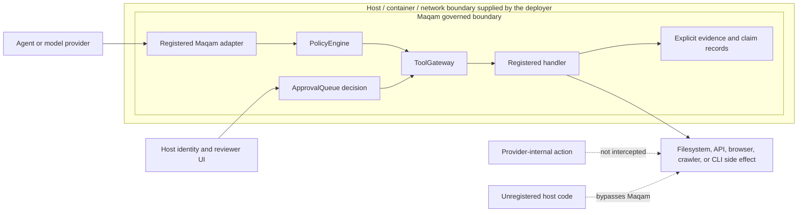

# Why Maqam

Maqam is a provider-neutral governance layer for TypeScript agent workflows. It is for teams that already know how to call a model, function, command-line worker, crawler, or service and need a clearer answer to four operational questions:

1. Was this tool allowed for this run?
2. Did a reviewer approve the exact action that executed?
3. Can the approval be replayed or reused?
4. Which recorded sources support the resulting claims?

Maqam does not try to be a model provider, a universal agent runtime, or a complete compliance platform. It puts registered workers behind one policy and evidence boundary.

## The Problem Is The Gap Between Intent And Execution

A chat message that says "approve the deployment" is not enough to establish what a program may execute. The environment, artifact, arguments, or target can change between a review screen and the eventual tool call. A generic approval id can also be reused for a second action unless the application prevents replay.

Maqam narrows that gap. For an approval-gated tool call, `ToolGateway` creates a request bound to the run id, tool name, and canonical input hash. The application approves that request, then retries the same call with the approval id. A changed input, different run, different tool, invalid decision, or consumed approval fails closed.

This is an execution-control property, not a claim that Maqam understands whether an action is wise. The reviewer and host application still decide what deserves approval.

## The Governance Path

```text
declared goal
    -> policy preflight
    -> registered ToolGateway call
    -> exact approval when required
    -> bounded adapter execution
    -> trace, usage, evidence, and claims
```

### Enforcement boundary



The host supplies reviewer authentication, trusted persistence, provider permissions, operating-system isolation, and network controls. Maqam governs the calls that enter its registered adapter and gateway path; provider-internal actions and unregistered code remain outside that boundary.

The path has four practical properties.

### Policy before the handler

`PolicyEngine` can restrict tools, origins, effects, runtime, and call counts. A workflow may lower configured limits, but it cannot raise the tenant policy ceiling. Tool-declared effects are a minimum: registration metadata may add risk, but it cannot erase an effect declared by the handler.

### Approval tied to the call

Gateway-generated approval requests describe the tool, run, input hash, and required approval actions. Approved records are consumed once by default. If several approvals are required, Maqam validates and consumes them atomically so a partial failure does not spend only part of the set.

### One detached execution input

Maqam validates and snapshots governed JSON input before policy, approval, and execution. The handler receives the detached value that was authorized instead of a caller-owned object that can be changed after validation.

### Evidence connected to claims

`EvidenceLedger` records source metadata, excerpts, content hashes, tool attribution, and same-run claim links. Scoped evidence capabilities stamp trusted run, task, and tool fields so a handler cannot choose them.

An evidence link is provenance, not semantic proof. It can show which recorded material a claim cites; it cannot establish that the source or claim is true.

## What Provider-Neutral Means

Maqam governs a stable callable boundary rather than one model protocol. A registered worker can be:

- a JavaScript function;
- an object with an explicitly bound `run`, `invoke`, or `call` method;
- a fixed command-line worker;
- Codex CLI or Claude Code through the bundled adapters;
- a crawler or browser adapter;
- an internal service or SaaS connector; or
- a write, publish, deploy, or messaging action.

Only calls routed through that registered boundary are governed. Maqam cannot intercept an unregistered process, and a provider may perform internal actions that Maqam observes only through the provider event stream. Use the provider permission system and an operating-system sandbox in addition to Maqam when those boundaries matter.

## A Concrete Approval Lifecycle

1. The application registers `publisher` with the `publish` effect.
2. Policy requires human approval for `publish`.
3. Run `release_42` calls `publisher` with an exact package, version, registry, and artifact digest.
4. The gateway does not invoke the handler. It creates a pending approval request.
5. A trusted reviewer approves that request.
6. The application retries the same run, tool, and input with the approval id.
7. The gateway validates the binding, invokes the handler with the authorized snapshot, and consumes the approval.
8. A changed target or a second use of the same approval fails.

The in-memory `ApprovalQueue` does not authenticate reviewers or make exported JSON tamper-proof. Persist approved records only in trusted, integrity-protected application storage and add application-level identity and authorization.

## Where Maqam Adds Value

### Release and deployment workflows

Bind approval to the exact artifact digest, commit, environment, and command instead of a broad "deploy" decision. `createReleaseGateReport` can validate the supplied release evidence and matching approval; it reports readiness and does not itself publish.

### Coding-agent boundaries

Run a CLI agent through fixed startup configuration, a controlled working directory, an environment allowlist, time and output limits, provider-safe defaults, and an explicit write-approval effect. A container or virtual machine remains the hard host boundary.

### Research and reporting

Route collection through origin policy and bounded crawler settings, attach records to the active run, connect claims to evidence ids, and reject unsupported claims before a report leaves the workflow.

Maqam 0.3 adds Governed Sources for applications with several retrieval backends. The registry can prefer an internal index, RSS/Atom source, licensed search provider, or public-web adapter, but the selected operation still executes through its exact registered `ToolGateway` name and returns one normalized document shape. This avoids rewriting policy and evidence plumbing for every provider.

Fallback is not a security bypass: ordinary unavailability may try another backend, while policy, approval, authentication/authorization, crawler-security, robots, goal-scope, and call-limit failures stop immediately. Authenticated sources need explicit route opt-in, and the host still owns credentials and provider permissions.

### Internal and customer-facing tools

Apply the same gateway semantics to email, ticketing, billing, repository, database, browser, and administrative connectors. The connector still needs its own authentication and least-privilege credentials.

## When Another Tool Is The Better Starting Point

Use a durable workflow engine such as LangGraph or Microsoft Agent Framework when restart-safe execution, long-running state, and broad orchestration are the main requirement. Use Microsoft Agent Governance Toolkit when a broader governance platform and its integrations fit the deployment. Use Firecrawl, Crawl4AI, Crawlee, or Browser Use when advanced crawling or browser automation is the center of the product. Maqam can sit around an adapter or service boundary to those systems, but it does not replace their feature depth.

See the [dated open-source comparison](comparison.md) for sources, stronger alternatives, and current limitations.

Agent Reach is a useful reference for broad, explicit source-channel setup and diagnostics. Maqam does not reproduce its automatic installation, browser-cookie/session reuse, or platform coverage. Maqam's narrower value is to put a host-supplied source operation behind the same exact policy/approval boundary as every other registered tool and normalize the returned documents. The implementation is independent; see [provenance and licenses](provenance-and-licenses.md).

## What The Published 0.2.4 Evaluation Establishes

The project-defined [Maqam Governance Evaluation Suite (MGES) v1](../benchmarks/README.md) evaluates two different things without combining them into a marketing score.

The historical 0.2.4 local-call performance profile reports a clean-source `127.498 microseconds/call` median on Node 24.15.0, Windows x64, and an AMD Ryzen 7 4800H. Its 95% bootstrap interval for the sample median is `126.334-128.942 microseconds/call`; 30 fresh-process observations produced a `5.572%` governed coefficient of variation and passed all five project stability checks. The timed path excludes model, network, storage, human review and concurrency.

The governance-boundary profile passes `12/12` project-defined fixtures covering default denial, fail-closed policy, exact run/tool/input approval binding, changed-input and replay rejection, immutable detached input, atomic multi-approval consumption, evidence attribution, and redacted denial traces.

Neither result is a globally accepted benchmark, security certification, penetration test, OWASP compliance statement, competitor ranking, or proof that unregistered code cannot bypass Maqam. The figures must not be presented as a 0.3.0 measurement. A fresh run is required when fingerprinted source changes. The [raw results and claim templates](../benchmarks/README.md) publish the exact scope and limitations; the [technical article](articles/benchmarking-agent-governance.md) explains the design.

## What The 0.3.0 Release Evaluation Establishes

MGES v1.1.0 reran from exact clean post-squash `main` commit `545fe8bbc40f21cec0f9ec2ae3954f3e75783f22`. Its Windows/Node 24 local-call profile records a `140.816 microseconds/call` governed median, a `138.983-142.820` 95% bootstrap interval for the sample median, and `5.020%` governed CV across 30 fresh-process observations. All four required criteria-version-2 stability checks passed, and the optional direct-path CV diagnostic also passed its 10% reference threshold.

The conformance profile passes `14/14` named fixtures. The two new cases establish only that a source policy denial stops all registered backends before dispatch, and that ordinary unavailability can fall back in deterministic order while binding the normalized document to the selected adapter. They do not establish provider correctness, network isolation, factual accuracy, or universal security.

## What The Published 0.3.1 Measured-Source Evaluation Establishes

The published 0.3.1 measured-source MGES v1.1.0 run measured exact clean source commit `a96413c4da5f27dc31b9772996e70faab0b38382` on Node 24.18.0 and a GitHub-hosted Ubuntu 24.04 x64 runner. It records a `129.849 microseconds/call` governed median, `129.539-130.648` 95% bootstrap interval for the sample median, `1.111%` governed CV, and 30 fresh-process observations with every required project criterion passing. The matching conformance artifact passes `14/14` named fixtures. The public npm artifact is bound to `2f7231db912012e37e89ec962f6d57c54c6275a3`, whose release-only delta leaves the fingerprinted implementation and benchmark source unchanged.

That source commit is the measured ancestor, not the eventual npm `gitHead`; the evidence-only follow-up changes package bytes and therefore requires a new exact tarball manifest before protected publication. MGES does not exercise the governed-browser adapter. Its separate browser tests cover the structural preview/apply/submit boundary, and neither test family is a security certification or proof of host-driver behavior.

## Maqam And ProductLoop OS

Maqam is the focused product and install for teams that want the governance boundary described above:

```bash
npm install maqam
```

[ProductLoop OS](https://github.com/AjnasNB/productloop-os) is a separate modular package suite for teams that want independently consumable runtime, skills, provenance, policy, evaluation, connector, approval, and browser-research modules. It depends on Maqam for the integrated governance path. The two projects are complementary rather than competing brands.

## Current Limits

- Runtime state, approvals, and evidence are in-process. JSON export lets the host persist state, but Maqam does not yet provide a durable store or restart-safe pause/resume.
- Approval records are structurally validated, not cryptographically signed or authenticated.
- Evidence hashes and links record provenance; they do not prove factual correctness.
- The built-in crawler is an HTTP/HTML connector, not a JavaScript-rendering browser or distributed crawl platform.
- Governed Sources does not install provider tools, log into platforms, import browser cookies/sessions, or bundle social-channel backends.
- `routeUngoverned()` is a deliberate direct bypass and carries no gateway policy, approval, call ceiling, or trace guarantee.
- Source-doctor checks are host functions; timeout and validation do not prove they are offline or side-effect free.
- Provider-reported usage and activity can be observed after execution; not every provider exposes a preventive hard limit for every measure.
- Calls that bypass registered adapters are outside Maqam's control.
- Passing tests is evidence for covered cases, not proof that the software has no defects.
- The historical 0.3.0 MGES artifacts record commit `545fe8bbc40f21cec0f9ec2ae3954f3e75783f22`; the published 0.3.1 measured-source artifacts record commit `a96413c4da5f27dc31b9772996e70faab0b38382`. Rerun if any fingerprinted implementation or benchmark source changes.

Those limits are part of the product boundary, not footnotes to hide. The [public roadmap](../ROADMAP.md) identifies which ones Maqam intends to address next.
